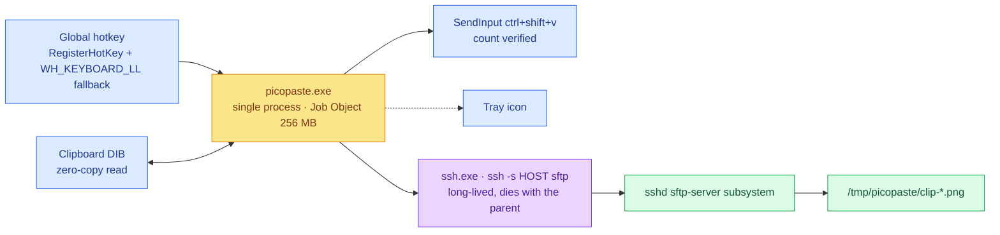
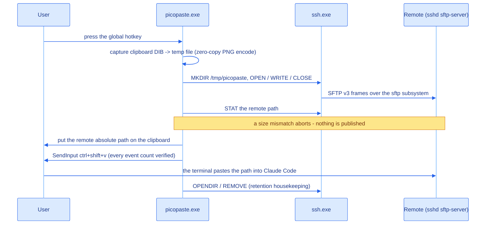
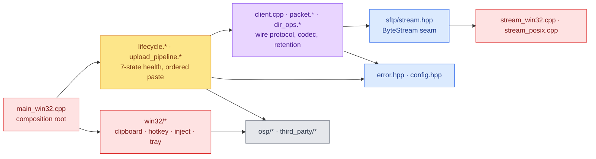

[English](README.md) | [中文](README_zh.md)

# picopaste

[](https://github.com/DeguiLiu/picopaste/actions/workflows/ci.yml)
[](LICENSE)

Press one global hotkey and the clipboard image goes to a Linux host; the remote absolute path is then
put on the clipboard and typed into the terminal so Claude Code can read the image. The remote needs
**no custom server-side code** — plain `sshd` and its `sftp-server`. One process, kernel-enforced
single instance and child containment, zero idle CPU, no scripts.

## Overview

The port that is *not* in that picture is the point: one long-lived channel whose child handle is
watched, so a lost link is an event — the tray turns red — not silence.

## Modules
| Module | Role |
|---|---|
| `include/picopaste/` | The public contract: every `Error` code, the `Config` struct, the SFTP v3 constants, the `ByteStream` seam, the `Client` declaration. Nothing here includes a `src/` file. |
| `src/core/sftp/` | SFTP v3 wire codec (`packet.*`), the sole owner of the channel (`client.cpp`), the remote retention policy (`dir_ops.*`). Platform-neutral; this is what the host tests exercise. |
| `src/core/app/` | `config.cpp` reads the INI; `lifecycle.*` is the 7-state health machine; `upload_pipeline.*` is the ordered paste sequence; `hook_install.*` manages a remote settings file (compiled and tested, wired into nothing). |
| `src/core/log/` | Bounded lock-free log ring plus rotation — one ring per producer, so the write side never locks and never allocates. |
| `src/platform/win32/` | Clipboard capture, global hotkey, SendInput injection, tray, single-instance mutex, Job Object containment, self-check — and `main_win32.cpp`, the composition root. |
| `src/platform/posix/` | The POSIX `ByteStream`; host tests only, never shipped. |

## How it works

Order is the contract: everything that can fail runs before the clipboard is written or a key is
sent, so a failed paste is visible and never a silent no-op.

## Architecture
The include graph is always inward — platform → core → public interfaces — never the other way.

`UploadPipeline::Run` takes `ClipboardOps` / `InjectOps` — function-pointer tables with an opaque
context, the same shape as `ByteStream`. That inversion is why the core stays free of `<windows.h>`
and is testable with fake tables.

## Usage
1. Put `picopaste.ini` next to the exe — `host = user@host` is the minimum. Every key and its default
   is in [`docs/design/picopaste-design.md`](docs/design/picopaste-design.md); a missing file is not an
   error, the defaults are used and the program says so.
2. Run `picopaste.exe`. A tray icon appears and connects immediately: green once the channel is up
   (a sub-second flicker of yellow at most), amber while retrying in the background.
3. Screenshot, then press the hotkey (default `alt+shift+v`). The remote path lands on the clipboard
   and is typed into the focused window.
4. A red tray means the link is down, or the deadline probe could not arm. `picopaste.exe --selftest`
   prints one `PASS`/`FAIL`/`SKIP` line per capability with a concrete number, and exits non-zero if
   any mandatory one failed.
5. A large screenshot needs room in `job_memory_limit_mb`: Windows materialises the clipboard image
   inside picopaste's own process, so the default 256 MB covers 4K and 8K captures. If only big
   screenshots fail, that ceiling is the first thing to raise.

## Build
newosp's `windows` branch is required: on `main`, `osp/platform.hpp` mistakes the `RT_VERSION` macro
from `<windows.h>` for an RT-Thread marker and includes a non-existent `<rtthread.h>`. Pin that branch
to the same commit CI uses — `git clone --branch` accepts only a branch or tag name, so a SHA needs
init + fetch + a detached checkout, and a moving ref could be force-pushed out from under the build.

```sh
git init ~/newosp-windows
git -C ~/newosp-windows remote add origin https://github.com/DeguiLiu/newosp.git
git -C ~/newosp-windows fetch --depth 1 origin 67c0a23b74d15f8ac33439072dea722631c530f5
git -C ~/newosp-windows checkout --detach FETCH_HEAD
cmake -S . -B build -DPICOPASTE_BUILD_TESTS=ON -DPICOPASTE_WERROR=ON \
  -DPICOPASTE_NEWOSP_DIR=$HOME/newosp-windows
cmake --build build -j"$(nproc)" && ctest --test-dir build --output-on-failure
```

On Windows add `-A x64` to `cmake` and `--config Release` to build and ctest. MIT — see [LICENSE](LICENSE).
