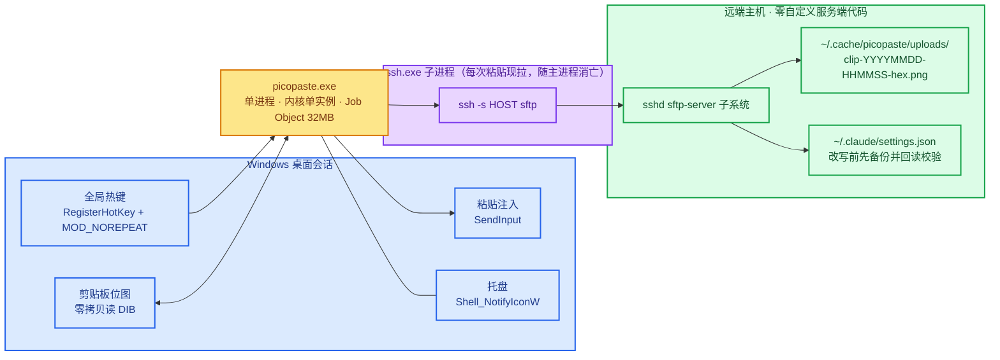
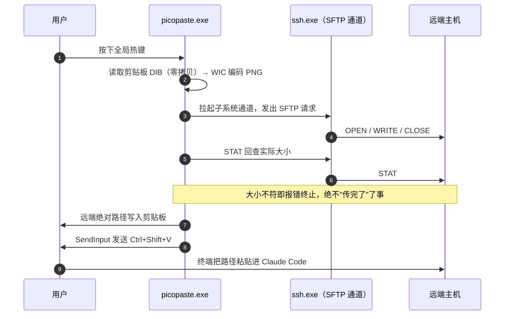

# picopaste

把 Windows 上的剪贴板贴图，变成远端 Claude Code 里的一条路径。

在 Windows 按一个全局热键，截图就上传到远端主机，远端绝对路径自动落在剪贴板并粘贴进终端。远端**不需要安装任何自定义服务端代码**——用的是 sshd 自带的 `sftp-server` 子系统。

这是一个 C++17 重写，目标不是"能用"，而是长期稳定、极低开销、失败立刻可见。

---

## 拓扑



**图中最关键的一点**：那条常驻转发端口不存在。原方案依赖长驻的 RemoteForward 端口，它断了不会有任何信号。这里每次粘贴现拉一个 `ssh -s <host> sftp` 子系统通道——隧道死掉立刻变成 `kChannelSpawnFailed`，而不是静默无操作。

## 一次粘贴发生了什么



注入的按键序列含 Ctrl 与 Shift 的释放事件，共 6 个，并校验 `SendInput` 的返回条数；数量不符即报 `kSendInputRejected`。焦点在等待期间发生变化则不发键、报 `kFocusChanged`。

## 远端为什么不需要服务端代码

| 需要的能力 | 用什么实现 |
|---|---|
| 写文件 | sshd 自带的 `sftp-server` 子系统 |
| 建目录、列目录、删除旧文件 | 同一子系统上的 SFTP v3 `MKDIR` / `OPENDIR` / `REMOVE` |
| 解析 `~/` 前缀 | SFTP `REALPATH`，不经过 shell |
| 改写 `~/.claude/settings.json` | SFTP `OPEN` / `READ` / `WRITE`，改写前备份 |

服务端是**纯 sshd + coreutils**。协议不追求与既有工具兼容，按上述场景自设计。

## 设计要点

- **失败必可见**：上传后回查远端大小；注入校验返回条数；通道断开立即上报。任何一步不成立就报错，不退回"大致成功"。
- **零拷贝读位图**：剪贴板的 DIB 通常自下而上，而 WIC 编码假定自顶向下；这里用一个按行映射的 `IWICBitmapSource` 直接读源 DIB，不整幅复制。4K 截图下这省掉约 33 MB 的峰值。
- **内核级单实例**：`Local\picopaste` 命名互斥体。会话作用域是刻意的——Windows 剪贴板本身按会话隔离。
- **子进程收容**：containment job 设 `KILL_ON_JOB_CLOSE`，主进程无论以何种方式退出（包括强杀）都由内核收走 `ssh.exe`，孤儿进程在原理上不可能存在。
- **运行时硬上限**：嵌套 Job Object 的 `JOB_OBJECT_LIMIT_JOB_MEMORY`，父进程与 `ssh.exe` 同受此限；越界是分配失败并报错，而不是静默增长。
- **无脚本**：监督、重启、日志轮转全部由二进制承担，树内没有 VBS / cmd / PowerShell。

## 构建

### Linux（主机测试）

核心层与平台无关，在 Linux 上直接可测，包含对**本机真实 `sftp-server`** 的端到端集成测试。

```sh
git clone --branch windows https://github.com/DeguiLiu/newosp.git ~/newosp-windows
cmake -S . -B build -DPICOPASTE_BUILD_TESTS=ON -DPICOPASTE_WERROR=ON \
  -DPICOPASTE_NEWOSP_DIR=$HOME/newosp-windows
cmake --build build -j"$(nproc)"
ctest --test-dir build --output-on-failure
```

### Windows（MSVC）

完整步骤见 [docs/build/windows-compile-test.md](docs/build/windows-compile-test.md)。

**依赖注意**：必须使用 newosp 的 `windows` 分支。`main` 上的 `osp/platform.hpp` 会把 `<windows.h>` 定义的 `RT_VERSION` 误判为 RT-Thread 标记，进而包含不存在的 `<rtthread.h>`。详见根 `CMakeLists.txt` 顶部注释。

## 当前状态

诚实列出，避免"看起来完成"：

| 项 | 状态 |
|---|---|
| SFTP v3 客户端、目录操作、保留策略 | 完成，对本机真实 sftp-server 有集成测试 |
| 远端 `settings.json` 钩子安装（含备份与还原） | 完成，有集成测试 |
| Windows 平台层（剪贴板 / 注入 / 单实例 / 托盘 / 热键） | 代码完成，**仅交叉编译语法检查过** |
| 能力自检 `picopaste.exe --selftest` | 完成，可在真实 Windows 上报告各项能力与内存上限 |
| **交互模式（托盘 / 热键 / 粘贴主循环）** | **未接线**。不带参数运行会明确报告未接线并以退出码 2 结束，而不是启动一个静默无作为的守护进程 |
| MSVC 真实构建 | CI 已接入；首次运行暴露的问题正在修复 |

`picopaste.exe` 目前只能自证：在终端运行 `picopaste --selftest`，它会逐个能力打印 PASS / FAIL / SKIP 与具体数值。

## 目录结构

```
include/picopaste/     对外接口：错误码、配置、SFTP 客户端
src/core/sftp/         SFTP v3 编解码与客户端（平台无关）
src/core/app/          配置、生命周期状态机、远端钩子安装
src/core/log/          定容日志与轮转
src/platform/posix/    主机侧字节流（`ssh -s host sftp` 子进程管道）
src/platform/win32/    Windows 层与入口点
tests/                 主机测试，含对真实 sftp-server 的集成测试
tools/                 构建门禁（去脚本、POSIX 泄漏）
third_party/           vendored 依赖，附来源与许可
docs/                  设计与构建文档
```

## 门禁

两道机械门禁随 `ctest` 一起跑，Linux 与 Windows 一致：

- `gate_no_scripts`：源码中不得出现脚本宿主调用。
- `gate_posix_leak`：Windows 可达路径不得引入 POSIX 头或符号（`src/platform/posix/` 豁免）。

两道都已用注入违规的方式验证过会真实失败。它们各自的局限写在脚本注释里——不要据此推断"不存在问题"。

## 许可

见 `third_party/` 下各依赖的许可文件。
