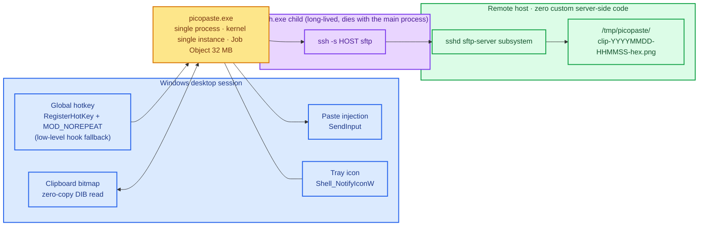

[English](README.md) | [中文](README_zh.md)

# picopaste

[](https://github.com/DeguiLiu/picopaste/actions/workflows/ci.yml)
[](LICENSE)

A Windows clipboard-to-remote-SFTP screenshot uploader, rewritten in C++17.

Press one global hotkey and the clipboard image is uploaded to a Linux host; the
remote absolute path lands on the clipboard and is typed into the terminal, so
Claude Code can read the image. The remote needs **no custom server-side code at
all** — it is plain `sshd` and its own `sftp-server` subsystem.

The rewrite's goal is not "it works" but long-term stability, very low overhead,
and failures that are always visible. It is a single process with a
kernel-enforced single instance, kernel-enforced child containment, zero idle
CPU, and no scripts anywhere in the tree.

## Overview



**The most important thing in that picture is the port that is not there.** The
previous design depended on a long-lived `RemoteForward` port, and when it died
nothing said so. Here the worker holds one **long-lived** `ssh -s <host> sftp`
subsystem channel and waits on the child's process handle; the moment the child
dies the handle signals, so a lost link becomes a real event (Ready → Degraded,
the tray turns red) instead of silence, and the worker then rebuilds it with
backoff.

The cost is stated plainly: a persistent channel removes the handshake from
every paste, but it **can quietly die**, so the child handle must be watched.
That same wait's timeout doubles as the backoff timer, and while idle every
thread blocks on a kernel object — no polling.

## How it works

One hotkey press runs a fixed order of steps, and the order is the contract.
Every step that can fail runs before anything is written to the clipboard or
typed into a terminal, so a failed paste is a visible failure and never a silent
no-op.

```mermaid
sequenceDiagram
  autonumber
  participant U as User
  participant P as picopaste.exe
  participant S as ssh.exe (SFTP channel)
  participant R as Remote host

  U->>P: press the global hotkey
  P->>P: capture clipboard DIB -> temp file (zero-copy PNG encode)
  P->>S: MKDIR /tmp/picopaste (MkdirAll, tolerant of existing)
  P->>S: OPEN / WRITE / CLOSE
  S->>R: SFTP v3 frames over the sshd sftp-server subsystem
  P->>S: STAT the remote path
  S->>R: STAT
  Note over P,R: on a size mismatch it aborts; nothing is published
  P->>U: put the remote absolute path on the clipboard
  P->>U: SendInput ctrl+shift+v (every event count verified)
  U->>R: the terminal pastes the path into Claude Code
  P->>S: OPENDIR / REMOVE (retention housekeeping)
```

Injection sends six events (Ctrl and Shift down, V down, V up, Ctrl and Shift
up) and checks `SendInput`'s return count; a short insert is reported as
`kSendInputRejected`. If the focus changes during the wait, no key is sent and
`kFocusChanged` is reported instead.

The remote needs no server-side code because everything it must do is expressed
in SFTP v3 operations the stock subsystem already implements:

| Capability needed | How it is done |
|---|---|
| Write a file | `sftp-server` from `sshd`, over `ssh -s <host> sftp` |
| Create, list and delete files | SFTP v3 `MKDIR` / `OPENDIR` / `REMOVE` on the same channel |
| Resolve a `~/` prefix | SFTP `REALPATH`; no shell, no `HOME` probe |
| Read or write a remote file | SFTP `OPEN` / `READ` / `WRITE` |

The server side is **stock `sshd` + coreutils**. The protocol is not trying to
be compatible with other tools; it is designed for exactly the calls above.

### Run-time health

The link is supervised by a 7-state machine built on newosp's `osp/hsm.hpp`:

`Init → Connecting → Ready → Degraded → Reconnecting → Stopping → Stopped`

- `Connecting --kConnectOk--> Ready`, `Connecting --kConnectFail--> Reconnecting`
- `Ready --kChannelLost--> Degraded` and `Ready --kConnectFail--> Degraded`: a
  dropped channel *or* a failed upload immediately turns the tray red rather
  than leaving it green while paste is quietly broken
- `Degraded --kRetry--> Reconnecting`; `Reconnecting` retries with exponential
  backoff (5 s base, 60 s cap, reset after 3 minutes of stability)
- `Stop` from any live state goes to `Stopping`, then `Stopped`

Tray colour follows the state: green in `Ready`, red in `Degraded` and
`Stopped`, yellow in the transitional states. The backoff policy is a pure
function and the clock is injectable, so the ramp is tested without real time.

### Design points

- **Failure must be visible**: the remote size is re-checked after upload, the
  `SendInput` event count is verified, and a dropped channel is reported at
  once. Any step that does not hold becomes an error — never a "close enough".
- **Zero-copy bitmap read**: a clipboard DIB is usually bottom-up while WIC
  encodes top-down. A per-scanline `IWICBitmapSource` reads the locked source
  DIB in place instead of copying the whole image; for a 4K screenshot that
  avoids a ~33 MB peak allocation.
- **Kernel-level single instance**: a `Local\picopaste` named mutex. The session
  scope is deliberate — the Windows clipboard is itself per-session.
- **Child containment**: the containment job sets `KILL_ON_JOB_CLOSE`, so
  whatever way the main process dies (including a hard kill) the kernel reaps
  `ssh.exe`; an orphan is impossible by construction.
- **Hard run-time ceiling**: a nested Job Object with
  `JOB_OBJECT_LIMIT_JOB_MEMORY` is applied to this process *and* to its
  `ssh.exe` children; exceeding it is an allocation failure that is reported,
  not silent growth.
- **No scripts**: supervision, restart and log rotation are all done in the
  binary; there is no VBS / cmd / PowerShell in the tree.

## Dependencies and call graph

This is the real include graph of the `.hpp` / `.cpp` files under
`include/`, `src/core/` and `src/platform/`. Edges are `#include` relationships;
`osp/*` (newosp) and `third_party/*` are external and are shown collapsed.

```mermaid
flowchart TB
  subgraph PUB["include/picopaste - public interfaces"]
    P_ERR["error.hpp"]
    P_CFG["config.hpp"]
    P_MEM["memsample.hpp"]
    P_PROTO["sftp/protocol.hpp"]
    P_STREAM["sftp/stream.hpp"]
    P_CLIENT["sftp/client.hpp"]
  end

  subgraph CS["src/core/sftp - SFTP v3 codec and client"]
    PKT_H["packet.hpp"]
    PKT_C["packet.cpp"]
    CLIENT_C["client.cpp"]
    DIR_H["dir_ops.hpp"]
    DIR_C["dir_ops.cpp"]
  end

  subgraph CA["src/core/app - application core"]
    CFG_C["config.cpp"]
    LIF_H["lifecycle.hpp"]
    LIF_C["lifecycle.cpp"]
    UP_H["upload_pipeline.hpp"]
    UP_C["upload_pipeline.cpp"]
    HOOK_H["hook_install.hpp"]
    HOOK_C["hook_install.cpp"]
  end

  subgraph CLOG["src/core/log - bounded logging"]
    LR_H["log_ring.hpp"]
    LR_C["log_ring.cpp"]
    LS_H["log_sink.hpp"]
    LS_C["log_sink.cpp"]
  end

  subgraph POSIX["src/platform/posix - host-side stream"]
    POS_H["stream_posix.hpp"]
    POS_C["stream_posix.cpp"]
  end

  subgraph PWIN["src/platform/win32 - Windows layer"]
    WU["win32_util.hpp"]
    CLP_H["clipboard.hpp"]
    CLP_C["clipboard.cpp"]
    HOT_H["hotkey.hpp"]
    HOT_C["hotkey.cpp"]
    INJ_H["inject.hpp"]
    INJ_C["inject.cpp"]
    SI_H["single_instance.hpp"]
    SI_C["single_instance.cpp"]
    SW_H["stream_win32.hpp"]
    SW_C["stream_win32.cpp"]
    TR_H["tray.hpp"]
    TR_C["tray.cpp"]
    TR_I["tray_icons.h"]
    ST_H["selftest.hpp"]
    ST_C["selftest.cpp"]
    MAIN["main_win32.cpp"]
  end

  subgraph EXT["external"]
    OSP["osp/* (newosp)"]
    PJ["third_party/picojson"]
    CLIPLIB["third_party/clip"]
  end

  P_CFG --> P_ERR
  P_CLIENT --> P_ERR
  P_CLIENT --> P_PROTO
  P_CLIENT --> P_STREAM

  PKT_H --> P_PROTO
  PKT_C --> PKT_H
  CLIENT_C --> PKT_H
  CLIENT_C --> P_CLIENT
  DIR_H --> P_ERR
  DIR_H --> P_CLIENT
  DIR_C --> DIR_H

  CFG_C --> P_CFG
  LIF_C --> LIF_H
  UP_H --> DIR_H
  UP_H --> P_CFG
  UP_H --> P_ERR
  UP_H --> P_CLIENT
  UP_C --> UP_H
  HOOK_H --> P_ERR
  HOOK_H --> P_CLIENT
  HOOK_H --> P_STREAM
  HOOK_C --> HOOK_H
  HOOK_C --> PJ

  LR_C --> LR_H
  LS_H --> LR_H
  LS_H --> P_ERR
  LS_C --> LS_H

  POS_H --> P_ERR
  POS_H --> P_STREAM
  POS_C --> POS_H

  WU --> P_ERR
  CLP_H --> P_CFG
  CLP_H --> P_ERR
  CLP_C --> CLP_H
  CLP_C --> WU
  HOT_H --> P_ERR
  HOT_C --> HOT_H
  INJ_H --> P_ERR
  INJ_C --> CLIPLIB
  INJ_C --> INJ_H
  INJ_C --> WU
  SI_H --> P_ERR
  SI_C --> SI_H
  SI_C --> WU
  SW_H --> P_ERR
  SW_H --> P_STREAM
  SW_C --> SW_H
  SW_C --> WU
  TR_H --> P_ERR
  TR_C --> SI_H
  TR_C --> SW_H
  TR_C --> TR_H
  TR_C --> TR_I
  TR_C --> WU
  ST_H --> P_CFG
  ST_H --> P_ERR
  ST_C --> CLP_H
  ST_C --> HOT_H
  ST_C --> P_CLIENT
  ST_C --> ST_H
  ST_C --> SI_H
  ST_C --> SW_H
  ST_C --> WU
  MAIN --> LIF_H
  MAIN --> UP_H
  MAIN --> CLIPLIB
  MAIN --> CLP_H
  MAIN --> HOT_H
  MAIN --> INJ_H
  MAIN --> ST_H
  MAIN --> SI_H
  MAIN --> SW_H
  MAIN --> TR_H
  MAIN --> WU
  MAIN --> P_CFG

  PUB -.-> OSP
  CS -.-> OSP
  CA -.-> OSP
  CLOG -.-> OSP
  POSIX -.-> OSP
  PWIN -.-> OSP

  classDef pub fill:#dbeafe,stroke:#2563eb,stroke-width:2px,color:#1e3a8a
  classDef sftpcore fill:#e9d5ff,stroke:#7c3aed,stroke-width:2px,color:#4c1d95
  classDef appcore fill:#fde68a,stroke:#d97706,stroke-width:2px,color:#78350f
  classDef logcore fill:#ccfbf1,stroke:#0d9488,stroke-width:2px,color:#134e4a
  classDef posix fill:#dcfce7,stroke:#16a34a,stroke-width:2px,color:#14532d
  classDef win fill:#fee2e2,stroke:#dc2626,stroke-width:2px,color:#7f1d1d
  classDef ext fill:#e5e7eb,stroke:#6b7280,stroke-width:2px,color:#374151

  class P_ERR,P_CFG,P_MEM,P_PROTO,P_STREAM,P_CLIENT pub
  class PKT_H,PKT_C,CLIENT_C,DIR_H,DIR_C sftpcore
  class CFG_C,LIF_H,LIF_C,UP_H,UP_C,HOOK_H,HOOK_C appcore
  class LR_H,LR_C,LS_H,LS_C logcore
  class POS_H,POS_C posix
  class WU,CLP_H,CLP_C,HOT_H,HOT_C,INJ_H,INJ_C,SI_H,SI_C,SW_H,SW_C,TR_H,TR_C,TR_I,ST_H,ST_C,MAIN win
  class OSP,PJ,CLIPLIB ext
```



### Layering

| Layer | Files | Depends on | Runtime role |
|---|---|---|---|
| Public interfaces | `error.hpp` (leaf), `memsample.hpp` (leaf), `config.hpp` → `error.hpp`, `sftp/protocol.hpp` (leaf), `sftp/stream.hpp` (leaf), `sftp/client.hpp` → `error.hpp`, `protocol.hpp`, `stream.hpp` | each other, nothing below | The stable contract surface. No header here includes a `src/` file. |
| SFTP core | `packet.hpp` → `protocol.hpp`; `packet.cpp` → `packet.hpp`; `client.cpp` → `packet.hpp`, `client.hpp`; `dir_ops.hpp` → `error.hpp`, `client.hpp`; `dir_ops.cpp` → `dir_ops.hpp` | public interfaces only | `packet.*` is the v3 wire codec; `client.cpp` is the single owner of the channel; `dir_ops.*` is the retention policy over `Client::ListDir`. |
| App core | `config.cpp` → `config.hpp`; `lifecycle.hpp` (leaf, uses `osp/hsm.hpp`) and `lifecycle.cpp` → `lifecycle.hpp`; `upload_pipeline.hpp` → `config.hpp`, `error.hpp`, `client.hpp`, `../sftp/dir_ops.hpp`, and `upload_pipeline.cpp` → `upload_pipeline.hpp`; `hook_install.hpp` → `error.hpp`, `client.hpp`, `stream.hpp` and `hook_install.cpp` → `hook_install.hpp`, `third_party/picojson` | public interfaces + SFTP core | `config.cpp` loads the INI; `lifecycle.*` supervises health; `upload_pipeline.*` is the ordered paste pipeline; `hook_install.*` manages a remote settings file. |
| Logging core | `log_ring.hpp` (leaf), `log_ring.cpp` → `log_ring.hpp`, `log_sink.hpp` → `log_ring.hpp`, `error.hpp`, `log_sink.cpp` → `log_sink.hpp` | public interfaces | Bounded in-memory ring plus rotation. |
| POSIX platform | `stream_posix.hpp` → `error.hpp`, `sftp/stream.hpp`; `stream_posix.cpp` → `stream_posix.hpp` | public interfaces | Host-side `ssh -s <host> sftp` child over pipes; used by the host tests. |
| Win32 platform | `win32_util.hpp` → `error.hpp`; `clipboard.hpp` → `config.hpp`, `error.hpp` and `clipboard.cpp` → `clipboard.hpp`, `win32_util.hpp`; `hotkey.*`, `inject.*`, `single_instance.*`, `stream_win32.*`, `tray.*`, `selftest.*`, `main_win32.cpp` | public interfaces + app core + `third_party/clip` | The Windows implementation and the process entry point. `main_win32.cpp` includes core app headers; nothing in core includes a platform header. |

### Call direction at run time

The include graph is always inward — platform → core → public interfaces — and
there is no edge in the other direction. At run time the direction is:

```
main_win32.cpp
  └─ Lifecycle (health)          lifecycle.hpp / lifecycle.cpp
  └─ UploadPipeline::Run         upload_pipeline.hpp / upload_pipeline.cpp
       └─ sftp::DirOps           dir_ops.hpp / dir_ops.cpp
            └─ sftp::Client      client.hpp / client.cpp  (the only wire-protocol owner)
                 └─ sftp::ByteStream   stream.hpp  (function-pointer table)
                      └─ ChildStream    stream_win32.hpp / stream_win32.cpp
                           └─ ssh -s <host> sftp  (sshd sftp-server)
```

`main_win32.cpp` is the composition root and the only translation unit that
touches every other layer: it loads the config (`config.cpp`), owns the
`Lifecycle` and the `UploadPipeline`, spawns the `ChildStream`, and wires
clipboard, hotkey, injection and tray. A hotkey message reaches
`UploadPipeline::Run`, which drives the upload through `DirOps` into the one
`Client`; `Client` never calls back up into the app.

There is exactly one deliberate inversion. `UploadPipeline::Run` is given
`ClipboardOps` and `InjectOps` — function-pointer tables with an opaque context,
the same shape as `ByteStream`. During a paste the core therefore calls *into*
the platform (capture, set clipboard text, inject the chord) through those
injected pointers. That is why the core can stay free of `<windows.h>`, and it
is what lets the pipeline be tested on the host with fake tables.

The platform seam is `include/picopaste/sftp/stream.hpp`: a platform-neutral
`ByteStream` (write / read / close, each blocking and all-or-nothing).
`stream_posix.hpp` and `stream_win32.hpp` are two independent implementations of
that one interface, and `sftp::Client` only ever sees the three function
pointers — it cannot tell which platform it is running on.

One module is not on the run-time path. `hook_install.*` (`RemoteSettings`) is
compiled and covered by tests, and it depends only on the public client and
stream, but **nothing in `main_win32.cpp` includes it**: it is a library module
for managing a remote settings file, not a command wired into the current
binary. The diagram and the table show it for what it is, not as a step of the
paste path.

## Configuration

The config file is read from `--config <path>`, or from
`<directory of the running executable>\picopaste.ini` when `--config` is absent.
A missing file is **not** an error: the built-in defaults are used and the
program notes that it did so. Values that are too long are reported, never
silently truncated.

| Key | Default | Meaning |
|---|---|---|
| `host` | *(empty)* | SSH `Host` alias from `~/.ssh/config`; the client never edits that file. |
| `remote_dir` | `/tmp/picopaste` | Remote upload directory, created by the client over SFTP (`MkdirAll`). A leading `~/` is resolved with `REALPATH`. |
| `hotkey` | `alt+shift+v` | Global hotkey, e.g. `alt+shift+v`. Parsed locally; it may not collide with the paste chords `ctrl+shift+v` or `ctrl+v`. |
| `delay_ms` | `150` | Milliseconds between publishing the path and sending the keystroke. |
| `upload_timeout_ms` | `30000` | How long one upload may stay in flight before it is treated as failed. `0` disables the deadline. |
| `restore_clipboard` | `true` | Put the image back on the clipboard after the paste. |
| `max_image_bytes` | `20971520` | Refuse images larger than this (20 MiB) instead of holding them. |
| `job_memory_limit_mb` | `32` | Hard Job Object commit ceiling on this process and its `ssh.exe` children. |
| `log_max_bytes` | `8388608` | Rotate the log at 8 MiB. |
| `log_keep_files` | `2` | Log generations to keep. |
| `log_level` | `info` | Log level. |
| `notify_enabled` | `true` | Parsed and round-tripped; there is no notification consumer wired up yet. |
| `ssh_command` | `ssh` | The `ssh` program to spawn; overridable to point at a wrapper. |

### Hotkey acquisition

`RegisterHotKey` with `MOD_NOREPEAT` is the first choice. If, and only if, it
fails with `ERROR_HOTKEY_ALREADY_REGISTERED` — another process already owns the
chord — the tool installs a `WH_KEYBOARD_LL` hook, which sees the keystroke
before the system dispatches it and can take the chord over. Any other failure
is reported unchanged; the fallback never swallows a different error. Which path
is live is never hidden: it is named in the self-check, the startup log and the
tray tooltip.

### Self-check

```
picopaste.exe --selftest [--config <path>]
```

prints one `PASS` / `FAIL` / `SKIP` line per capability, each with a concrete
number (byte counts, the enforced memory limit, a resolved remote path), and
exits non-zero if any mandatory capability failed. This is the vehicle for
verifying a build on a real machine.

## Build and license

### Windows (MSVC)

```bat
git clone --branch windows https://github.com/DeguiLiu/newosp.git %USERPROFILE%\newosp-windows
cmake -S . -B build -A x64 -DPICOPASTE_BUILD_TESTS=ON -DPICOPASTE_WERROR=ON ^
  -DPICOPASTE_NEWOSP_DIR=%USERPROFILE%\newosp-windows
cmake --build build --config Release
ctest --test-dir build -C Release --output-on-failure
```

CI also builds and tests the platform-neutral layers (`include/picopaste`,
`src/core/*`, and the POSIX byte-stream) on Linux, including end-to-end
integration tests against a real local `sftp-server` and a sanitizer matrix:

```sh
git clone --branch windows https://github.com/DeguiLiu/newosp.git ~/newosp-windows
cmake -S . -B build -DPICOPASTE_BUILD_TESTS=ON -DPICOPASTE_WERROR=ON \
  -DPICOPASTE_NEWOSP_DIR=$HOME/newosp-windows
cmake --build build -j"$(nproc)"
ctest --test-dir build --output-on-failure
```

**Dependency note**: newosp's `windows` branch is required. On `main`,
`osp/platform.hpp` mistakes the `RT_VERSION` macro defined by `<windows.h>` for
an RT-Thread marker and then includes a non-existent `<rtthread.h>`; the note at
the top of the root `CMakeLists.txt` has the details.

### License

picopaste is released under the **MIT License**. See [LICENSE](LICENSE) —
Copyright (c) 2026 liudegui. Vendored components under `third_party/` carry
their own licences and provenance, recorded alongside each dependency.
