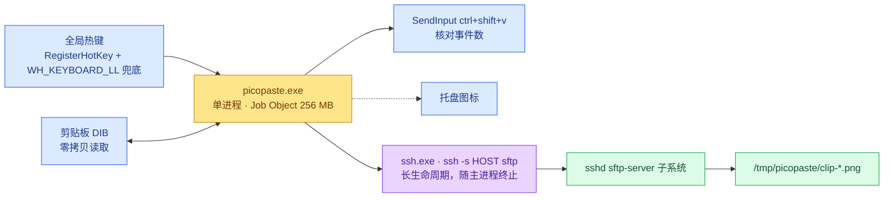
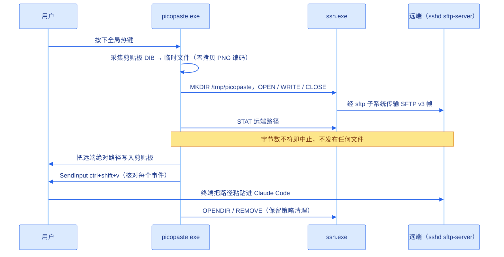
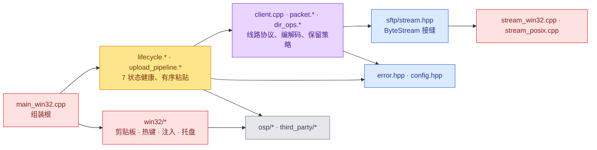

[English](README.md) | [中文](README_zh.md)

# picopaste

[](https://github.com/DeguiLiu/picopaste/actions/workflows/ci.yml)
[](LICENSE)

按一次全局热键，剪贴板里的图片就会上传到 Linux 主机；远端绝对路径随即写入剪贴板并敲进终端，
Claude Code 据此读到这张图。远端**不需要任何自研服务端代码**——只用 stock `sshd` 和它自带的
`sftp-server`。单进程、内核级单实例与子进程收容、空闲 CPU 为零、全树无脚本。

## 概览

图中**不存在**的那个端口才是重点：只有一条长生命周期通道，守护它的是子进程句柄——链路一断就是
一个事件（托盘变红），而不是沉默。

## 模块
| 模块 | 作用 |
|---|---|
| `include/picopaste/` | 对外契约：全部 `Error` 码、`Config` 结构、SFTP v3 常量、`ByteStream` 接缝、`Client` 声明。这一层没有任何文件包含 `src/` 下的东西。 |
| `src/core/sftp/` | SFTP v3 线路编解码（`packet.*`）、通道的唯一持有者（`client.cpp`）、远端保留策略（`dir_ops.*`）。平台无关，host 测试跑的就是这一层。 |
| `src/core/app/` | `config.cpp` 读 INI；`lifecycle.*` 是 7 状态健康机；`upload_pipeline.*` 是有序粘贴链路；`hook_install.*` 管理远端 settings 文件（有编译有测试，但未接线）。 |
| `src/core/log/` | 定长无锁日志环 + 轮转——每个写者一条环，写侧不加锁也不分配。 |
| `src/platform/win32/` | 剪贴板采集、全局热键、SendInput 注入、托盘、单实例互斥、Job Object 收容、自检，以及组装根 `main_win32.cpp`。 |
| `src/platform/posix/` | POSIX `ByteStream`，仅 host 测试用，不随产品发布。 |

## 工作流程

步骤顺序就是契约：所有可能失败的步骤都在写剪贴板或敲键**之前**跑完，所以一次失败的粘贴一定
可见，绝不静默无操作。

## 架构
include 图始终向内——platform → core → 对外接口，绝不反向。

`UploadPipeline::Run` 接收 `ClipboardOps` / `InjectOps`——带不透明 ctx 的函数指针表，与 `ByteStream`
同形。正是这一处反转让 core 不碰 `<windows.h>`，并能用假表在 host 上测试。

## 如何使用
1. 把 `picopaste.ini` 放在 exe 同目录——最少只需 `host = user@host`。每个键及其默认值见
   [`docs/design/picopaste-design.md`](docs/design/picopaste-design.md)；文件不存在不算错误，会用
   内置默认值并提示。
2. 运行 `picopaste.exe`。托盘图标出现即立刻建连：通道就绪后为绿（启动至多闪一下黄），
   后台重试期间为琥珀色。
3. 截图后按热键（默认 `alt+shift+v`）。远端路径写入剪贴板并敲进当前焦点窗口。
4. 托盘变红表示链路已断，或截止探针未能武装。`picopaste.exe --selftest` 对每项能力打印一行
   `PASS`/`FAIL`/`SKIP` 并附具体数字，任一必需能力失败即返回非零。
5. 大截图的成败取决于 `job_memory_limit_mb`：Windows 会把整张剪贴板图片落地在 picopaste 自己的
   进程里，默认 256 MB 足以容纳 4K 与 8K 截图。若只有大截图失败，先调高这个上限。

## 构建
必须使用 newosp 的 `windows` 分支，因为 `main` 上 `osp/platform.hpp` 会把 `<windows.h>` 定义的
`RT_VERSION` 误判为 RT-Thread 标记，进而包含一个不存在的头文件。该分支与 CI 一样钉在同一个提交上：
`git clone --branch` 只接受分支名或标签名，钉提交得走 init + fetch + 分离检出；而分支是会移动的
引用，一次 force-push 就能在本仓库毫无改动的情况下弄坏构建。

```sh
git init ~/newosp-windows
git -C ~/newosp-windows remote add origin https://github.com/DeguiLiu/newosp.git
git -C ~/newosp-windows fetch --depth 1 origin 67c0a23b74d15f8ac33439072dea722631c530f5
git -C ~/newosp-windows checkout --detach FETCH_HEAD
cmake -S . -B build -DPICOPASTE_BUILD_TESTS=ON -DPICOPASTE_WERROR=ON \
  -DPICOPASTE_NEWOSP_DIR=$HOME/newosp-windows
cmake --build build -j"$(nproc)" && ctest --test-dir build --output-on-failure
```

Windows 上给 `cmake` 加 `-A x64`，给 build 与 ctest 加 `--config Release`。MIT，见 [LICENSE](LICENSE)。
