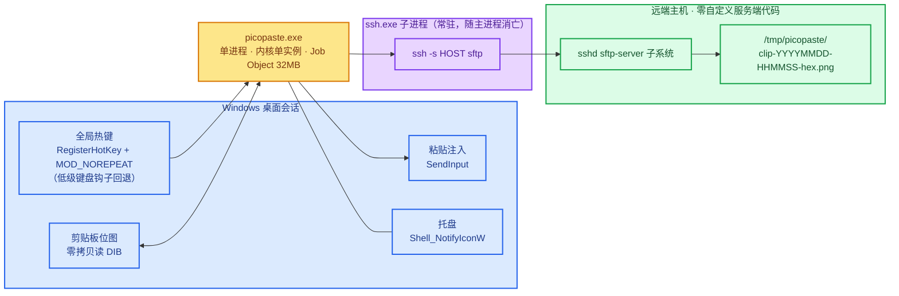
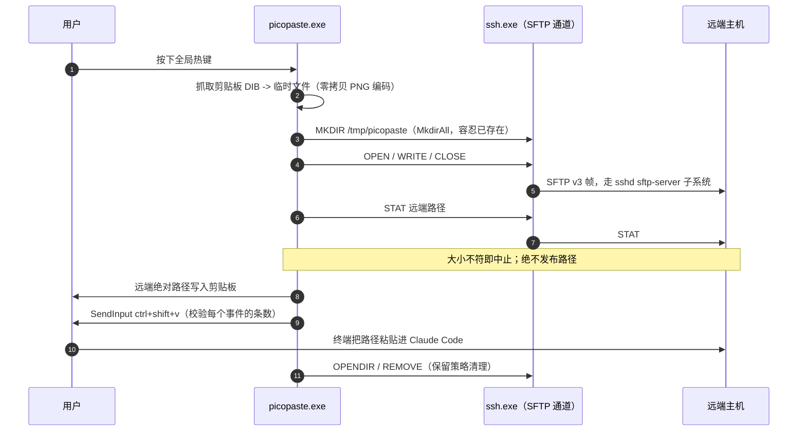

[English](README.md) | [中文](README_zh.md)

# picopaste

[](https://github.com/DeguiLiu/picopaste/actions/workflows/ci.yml)
[](LICENSE)

把 Windows 上的剪贴板贴图上传到远端 SFTP 的工具，C++17 重写。

在 Windows 按一个全局热键，剪贴板里的截图就上传到远端 Linux 主机；远端绝对
路径自动落在剪贴板并粘贴进终端，Claude Code 便能读取这张图。远端**不需要任何
自定义服务端代码**——只用 `sshd` 自带的 `sftp-server` 子系统。

这次重写的目标不是"能用"，而是长期稳定、极低开销、失败立刻可见。它是单进程，
内核强制单实例，内核强制收容子进程，空闲零 CPU，树内没有任何脚本。

## 概览



**图中最关键的一点**：那条转发端口不存在。旧方案依赖长驻的 RemoteForward
端口，而它断了不会有任何信号。这里由 worker 持有一条**常驻**的
`ssh -s <host> sftp` 子系统通道，并等待子进程的句柄——子进程一死，句柄立刻
发出信号，失联因此变成一个真实事件（Ready → Degraded，托盘转红）而不是沉默；
随后按退避重建。

代价说清楚：常驻通道省掉每次粘贴的握手，但它**确实可能悄悄死掉**，所以必须
盯着子进程句柄。这个等待的超时同时充当退避定时器，空闲时线程全部阻塞在内核
对象上，不轮询。

## 工作原理

一次热键按下按固定顺序执行，而这个顺序就是契约。每一步可能失败的操作都发生
在写入剪贴板或向终端发键之前，因此失败的粘贴是一次可见的失败，绝不会变成静默
的空操作。



注入共发送 6 个事件（Ctrl、Shift 按下，V 按下，V 抬起，Ctrl、Shift 抬起），
并校验 `SendInput` 的返回条数；数量不符报 `kSendInputRejected`。等待期间焦点
发生变化则不发键，报 `kFocusChanged`。

远端为什么不需要服务端代码——它需要做的每一件事，都用现成子系统已实现的
SFTP v3 操作表达：

| 需要的能力 | 用什么实现 |
|---|---|
| 写文件 | `ssh -s <host> sftp` 之上的 `sshd` 自带 `sftp-server` |
| 建、列、删文件 | 同一通道上的 SFTP v3 `MKDIR` / `OPENDIR` / `REMOVE` |
| 解析 `~/` 前缀 | SFTP `REALPATH`；不经过 shell，也不探测 `HOME` |
| 读写远端文件 | SFTP `OPEN` / `READ` / `WRITE` |

服务端是**纯 `sshd` + coreutils**。协议不追求与既有工具兼容，只为上述调用
而设计。

### 运行期健康

链路由 `osp/hsm.hpp`（newosp）之上的 7 态状态机监督：

`Init → Connecting → Ready → Degraded → Reconnecting → Stopping → Stopped`

- `Connecting --kConnectOk--> Ready`，`Connecting --kConnectFail--> Reconnecting`
- `Ready --kChannelLost--> Degraded` 与 `Ready --kConnectFail--> Degraded`：
  通道断开**或**上传失败都立即把托盘转红，而不是在粘贴已经悄悄失效时仍保持绿色
- `Degraded --kRetry--> Reconnecting`；`Reconnecting` 以指数退避重试
  （基准 5 秒，上限 60 秒，稳定 3 分钟后重置）
- 任一存活状态收到 `Stop` 都进入 `Stopping`，再到 `Stopped`

托盘颜色跟随状态：`Ready` 绿色，`Degraded` 与 `Stopped` 红色，过渡态黄色。
退避策略是纯函数，时钟可注入，因此退避曲线无需真实时间即可测试。

### 设计要点

- **失败必可见**：上传后回查远端大小；校验 `SendInput` 的事件条数；通道断开
  立即上报。任何一步不成立就报错，不退回"大致成功"。
- **零拷贝读位图**：剪贴板的 DIB 通常自下而上，而 WIC 编码假定自顶向下。
  用一个按行映射的 `IWICBitmapSource` 直接读锁定的源 DIB，而不是整幅复制；
  4K 截图下这避免约 33 MB 的峰值分配。
- **内核级单实例**：`Local\picopaste` 命名互斥体。会话作用域是刻意的——Windows
  剪贴板本身按会话隔离。
- **子进程收容**：containment job 设 `KILL_ON_JOB_CLOSE`，主进程无论以何种
  方式退出（包括强杀）都由内核收走 `ssh.exe`；孤儿进程在原理上不可能存在。
- **运行时硬上限**：嵌套 Job Object 的 `JOB_OBJECT_LIMIT_JOB_MEMORY` 施加于
  本进程**及其** `ssh.exe` 子进程；越界是分配失败并报错，而不是静默增长。
- **无脚本**：监督、重启、日志轮转全部由二进制承担，树内没有 VBS / cmd /
  PowerShell。

## 依赖与调用关系

以下是 `include/`、`src/core/`、`src/platform/` 下 `.hpp` / `.cpp` 文件的真实
包含图。边是 `#include` 关系；`osp/*`（newosp）与 `third_party/*` 属于外部
依赖，折叠显示。

```mermaid
flowchart TB
  subgraph PUB["include/picopaste - 对外接口"]
    P_ERR["error.hpp"]
    P_CFG["config.hpp"]
    P_MEM["memsample.hpp"]
    P_PROTO["sftp/protocol.hpp"]
    P_STREAM["sftp/stream.hpp"]
    P_CLIENT["sftp/client.hpp"]
  end

  subgraph CS["src/core/sftp - SFTP v3 编解码与客户端"]
    PKT_H["packet.hpp"]
    PKT_C["packet.cpp"]
    CLIENT_C["client.cpp"]
    DIR_H["dir_ops.hpp"]
    DIR_C["dir_ops.cpp"]
  end

  subgraph CA["src/core/app - 应用核心"]
    CFG_C["config.cpp"]
    LIF_H["lifecycle.hpp"]
    LIF_C["lifecycle.cpp"]
    UP_H["upload_pipeline.hpp"]
    UP_C["upload_pipeline.cpp"]
    HOOK_H["hook_install.hpp"]
    HOOK_C["hook_install.cpp"]
  end

  subgraph CLOG["src/core/log - 定容日志"]
    LR_H["log_ring.hpp"]
    LR_C["log_ring.cpp"]
    LS_H["log_sink.hpp"]
    LS_C["log_sink.cpp"]
  end

  subgraph POSIX["src/platform/posix - 主机侧字节流"]
    POS_H["stream_posix.hpp"]
    POS_C["stream_posix.cpp"]
  end

  subgraph PWIN["src/platform/win32 - Windows 层"]
    WU["win32_util.hpp"]
    CLP_H["clipboard.hpp"]
    CLP_C["clipboard.cpp"]
    HOT_H["hotkey.hpp"]
    HOT_C["hotkey.cpp"]
    INJ_H["inject.hpp"]
    INJ_C["inject.cpp"]
    SI_H["single_instance.hpp"]
    SI_C["single_instance.cpp"]
    SW_H["stream_win32.hpp"]
    SW_C["stream_win32.cpp"]
    TR_H["tray.hpp"]
    TR_C["tray.cpp"]
    TR_I["tray_icons.h"]
    ST_H["selftest.hpp"]
    ST_C["selftest.cpp"]
    MAIN["main_win32.cpp"]
  end

  subgraph EXT["外部依赖"]
    OSP["osp/*（newosp）"]
    PJ["third_party/picojson"]
    CLIPLIB["third_party/clip"]
  end

  P_CFG --> P_ERR
  P_CLIENT --> P_ERR
  P_CLIENT --> P_PROTO
  P_CLIENT --> P_STREAM

  PKT_H --> P_PROTO
  PKT_C --> PKT_H
  CLIENT_C --> PKT_H
  CLIENT_C --> P_CLIENT
  DIR_H --> P_ERR
  DIR_H --> P_CLIENT
  DIR_C --> DIR_H

  CFG_C --> P_CFG
  LIF_C --> LIF_H
  UP_H --> DIR_H
  UP_H --> P_CFG
  UP_H --> P_ERR
  UP_H --> P_CLIENT
  UP_C --> UP_H
  HOOK_H --> P_ERR
  HOOK_H --> P_CLIENT
  HOOK_H --> P_STREAM
  HOOK_C --> HOOK_H
  HOOK_C --> PJ

  LR_C --> LR_H
  LS_H --> LR_H
  LS_H --> P_ERR
  LS_C --> LS_H

  POS_H --> P_ERR
  POS_H --> P_STREAM
  POS_C --> POS_H

  WU --> P_ERR
  CLP_H --> P_CFG
  CLP_H --> P_ERR
  CLP_C --> CLP_H
  CLP_C --> WU
  HOT_H --> P_ERR
  HOT_C --> HOT_H
  INJ_H --> P_ERR
  INJ_C --> CLIPLIB
  INJ_C --> INJ_H
  INJ_C --> WU
  SI_H --> P_ERR
  SI_C --> SI_H
  SI_C --> WU
  SW_H --> P_ERR
  SW_H --> P_STREAM
  SW_C --> SW_H
  SW_C --> WU
  TR_H --> P_ERR
  TR_C --> SI_H
  TR_C --> SW_H
  TR_C --> TR_H
  TR_C --> TR_I
  TR_C --> WU
  ST_H --> P_CFG
  ST_H --> P_ERR
  ST_C --> CLP_H
  ST_C --> HOT_H
  ST_C --> P_CLIENT
  ST_C --> ST_H
  ST_C --> SI_H
  ST_C --> SW_H
  ST_C --> WU
  MAIN --> LIF_H
  MAIN --> UP_H
  MAIN --> CLIPLIB
  MAIN --> CLP_H
  MAIN --> HOT_H
  MAIN --> INJ_H
  MAIN --> ST_H
  MAIN --> SI_H
  MAIN --> SW_H
  MAIN --> TR_H
  MAIN --> WU
  MAIN --> P_CFG

  PUB -.-> OSP
  CS -.-> OSP
  CA -.-> OSP
  CLOG -.-> OSP
  POSIX -.-> OSP
  PWIN -.-> OSP

  classDef pub fill:#dbeafe,stroke:#2563eb,stroke-width:2px,color:#1e3a8a
  classDef sftpcore fill:#e9d5ff,stroke:#7c3aed,stroke-width:2px,color:#4c1d95
  classDef appcore fill:#fde68a,stroke:#d97706,stroke-width:2px,color:#78350f
  classDef logcore fill:#ccfbf1,stroke:#0d9488,stroke-width:2px,color:#134e4a
  classDef posix fill:#dcfce7,stroke:#16a34a,stroke-width:2px,color:#14532d
  classDef win fill:#fee2e2,stroke:#dc2626,stroke-width:2px,color:#7f1d1d
  classDef ext fill:#e5e7eb,stroke:#6b7280,stroke-width:2px,color:#374151

  class P_ERR,P_CFG,P_MEM,P_PROTO,P_STREAM,P_CLIENT pub
  class PKT_H,PKT_C,CLIENT_C,DIR_H,DIR_C sftpcore
  class CFG_C,LIF_H,LIF_C,UP_H,UP_C,HOOK_H,HOOK_C appcore
  class LR_H,LR_C,LS_H,LS_C logcore
  class POS_H,POS_C posix
  class WU,CLP_H,CLP_C,HOT_H,HOT_C,INJ_H,INJ_C,SI_H,SI_C,SW_H,SW_C,TR_H,TR_C,TR_I,ST_H,ST_C,MAIN win
  class OSP,PJ,CLIPLIB ext
```



### 分层说明

| 层 | 文件 | 依赖 | 运行期角色 |
|---|---|---|---|
| 对外接口 | `error.hpp`（叶）、`memsample.hpp`（叶）、`config.hpp` → `error.hpp`、`sftp/protocol.hpp`（叶）、`sftp/stream.hpp`（叶）、`sftp/client.hpp` → `error.hpp`、`protocol.hpp`、`stream.hpp` | 层内彼此，不依赖更下层 | 稳定的契约面。这一层没有任何头文件包含 `src/` 下的文件。 |
| SFTP 核心 | `packet.hpp` → `protocol.hpp`；`packet.cpp` → `packet.hpp`；`client.cpp` → `packet.hpp`、`client.hpp`；`dir_ops.hpp` → `error.hpp`、`client.hpp`；`dir_ops.cpp` → `dir_ops.hpp` | 仅对外接口 | `packet.*` 是 v3 线协议编解码；`client.cpp` 是通道的唯一所有者；`dir_ops.*` 是 `Client::ListDir` 之上的保留策略。 |
| 应用核心 | `config.cpp` → `config.hpp`；`lifecycle.hpp`（叶，用 `osp/hsm.hpp`）与 `lifecycle.cpp` → `lifecycle.hpp`；`upload_pipeline.hpp` → `config.hpp`、`error.hpp`、`client.hpp`、`../sftp/dir_ops.hpp`，`upload_pipeline.cpp` → `upload_pipeline.hpp`；`hook_install.hpp` → `error.hpp`、`client.hpp`、`stream.hpp`，`hook_install.cpp` → `hook_install.hpp`、`third_party/picojson` | 对外接口 + SFTP 核心 | `config.cpp` 读 INI；`lifecycle.*` 监督健康；`upload_pipeline.*` 是按序的粘贴流水线；`hook_install.*` 管理远端设置文件。 |
| 日志核心 | `log_ring.hpp`（叶）、`log_ring.cpp` → `log_ring.hpp`、`log_sink.hpp` → `log_ring.hpp`、`error.hpp`、`log_sink.cpp` → `log_sink.hpp` | 对外接口 | 定容环形缓冲与轮转。 |
| POSIX 平台 | `stream_posix.hpp` → `error.hpp`、`sftp/stream.hpp`；`stream_posix.cpp` → `stream_posix.hpp` | 对外接口 | 主机侧管道上的 `ssh -s <host> sftp` 子进程；供主机测试使用。 |
| Win32 平台 | `win32_util.hpp` → `error.hpp`；`clipboard.hpp` → `config.hpp`、`error.hpp`，`clipboard.cpp` → `clipboard.hpp`、`win32_util.hpp`；`hotkey.*`、`inject.*`、`single_instance.*`、`stream_win32.*`、`tray.*`、`selftest.*`、`main_win32.cpp` | 对外接口 + 应用核心 + `third_party/clip` | Windows 实现与进程入口。`main_win32.cpp` 包含应用核心头文件；而核心层不包含任何平台头文件。 |

### 运行期的调用方向

包含图始终向内——平台 → 核心 → 对外接口——反向没有任何一条边。运行期的调用
方向是：

```
main_win32.cpp
  └─ Lifecycle（健康）              lifecycle.hpp / lifecycle.cpp
  └─ UploadPipeline::Run            upload_pipeline.hpp / upload_pipeline.cpp
       └─ sftp::DirOps              dir_ops.hpp / dir_ops.cpp
            └─ sftp::Client         client.hpp / client.cpp（线协议的唯一所有者）
                 └─ sftp::ByteStream  stream.hpp（函数指针表）
                      └─ ChildStream  stream_win32.hpp / stream_win32.cpp
                           └─ ssh -s <host> sftp（sshd sftp-server）
```

`main_win32.cpp` 是组合根，也是唯一触及所有其它层的翻译单元：它加载配置
（`config.cpp`），持有 `Lifecycle` 与 `UploadPipeline`，派生 `ChildStream`，
并接线剪贴板、热键、注入与托盘。热键消息到达 `UploadPipeline::Run`，由它经
`DirOps` 驱动唯一的 `Client` 完成上传；`Client` 从不反向调用应用层。

只有一处刻意的反向依赖。`UploadPipeline::Run` 接收 `ClipboardOps` 与
`InjectOps`——带不透明 ctx 的函数指针表，形状与 `ByteStream` 相同。因此粘贴
期间核心会通过注入的指针*调用进*平台（抓图、写剪贴板文本、注入按键）。这正是
核心得以不包含 `<windows.h>` 的原因，也让流水线能用假的函数指针表在主机上
测试。

平台接缝是 `include/picopaste/sftp/stream.hpp`：一个平台中立的 `ByteStream`
（write / read / close，均为阻塞且全有或全无）。`stream_posix.hpp` 与
`stream_win32.hpp` 是同一个接口的两份独立实现，而 `sftp::Client` 只看到那
三个函数指针——它无法分辨自己跑在哪个平台上。

有一个模块不在运行期路径上。`hook_install.*`（`RemoteSettings`）会被编译、
也有测试覆盖，且只依赖对外的 client 与 stream，但 **`main_win32.cpp` 中没有任何
一处包含它**：它是一个管理远端设置文件的库模块，不是接进当前二进制的命令。
图上和表里如实地呈现这一点，而不是把它当作粘贴路径的一步。

## 配置

配置文件的来源是 `--config <path>`；不带 `--config` 时，读取
`<运行中可执行文件所在目录>\picopaste.ini`。文件缺失**不是**错误：使用内置
默认值，程序会提示这一点。过长的值会被报错，绝不静默截断。

| 键 | 默认值 | 含义 |
|---|---|---|
| `host` | （空） | `~/.ssh/config` 中的 SSH `Host` 别名；客户端从不编辑该文件。 |
| `remote_dir` | `/tmp/picopaste` | 远端上传目录，由客户端经 SFTP 创建（`MkdirAll`）。前导 `~/` 用 `REALPATH` 解析。 |
| `hotkey` | `alt+shift+v` | 全局热键，如 `alt+shift+v`。本地解析；不得与粘贴组合键 `ctrl+shift+v`、`ctrl+v` 冲突。 |
| `delay_ms` | `150` | 发布路径与发送按键之间的毫秒数。 |
| `upload_timeout_ms` | `30000` | 一次上传在途多久后视为失败。`0` 表示关闭该超时。 |
| `restore_clipboard` | `true` | 粘贴后把图像放回剪贴板。 |
| `max_image_bytes` | `20971520` | 超过此值（20 MiB）的图像将拒绝处理，而不是留在内存里。 |
| `job_memory_limit_mb` | `32` | 施加于本进程及其 `ssh.exe` 子进程的 Job Object 提交硬上限。 |
| `log_max_bytes` | `8388608` | 日志达到 8 MiB 即轮转。 |
| `log_keep_files` | `2` | 保留的日志代数。 |
| `log_level` | `info` | 日志级别。 |
| `notify_enabled` | `true` | 会被解析并回写；目前还没有接上通知的消费者。 |
| `ssh_command` | `ssh` | 要派生的 `ssh` 程序；可指向一个包装脚本。 |

### 热键获取

首选带 `MOD_NOREPEAT` 的 `RegisterHotKey`。当且仅当它以
`ERROR_HOTKEY_ALREADY_REGISTERED` 失败——组合键已被另一个进程占用——工具会
安装一个 `WH_KEYBOARD_LL` 钩子，它在系统派发之前看到按键，因此可以把这个组合
键抢过来。其它任何失败都原样上报；回退绝不吞掉另一种错误。当前生效的是哪条
路径从不隐藏：自检、启动日志与托盘提示里都会写明。

### 能力自检

```
picopaste.exe --selftest [--config <path>]
```

为每项能力打印一行 `PASS` / `FAIL` / `SKIP`，每行都带具体数值（字节数、实际
生效的内存上限、解析出的远端路径）；只要有强制性能力失败就以非零码退出。这是
在真机上核对一次构建的手段。

## 构建与许可

### Windows（MSVC）

```bat
git clone --branch windows https://github.com/DeguiLiu/newosp.git %USERPROFILE%\newosp-windows
cmake -S . -B build -A x64 -DPICOPASTE_BUILD_TESTS=ON -DPICOPASTE_WERROR=ON ^
  -DPICOPASTE_NEWOSP_DIR=%USERPROFILE%\newosp-windows
cmake --build build --config Release
ctest --test-dir build -C Release --output-on-failure
```

CI 还会在 Linux 上构建并测试平台中立的各层（`include/picopaste`、
`src/core/*` 与 POSIX 字节流），包括对**本机真实 `sftp-server`** 的端到端
集成测试和 sanitizer 矩阵：

```sh
git clone --branch windows https://github.com/DeguiLiu/newosp.git ~/newosp-windows
cmake -S . -B build -DPICOPASTE_BUILD_TESTS=ON -DPICOPASTE_WERROR=ON \
  -DPICOPASTE_NEWOSP_DIR=$HOME/newosp-windows
cmake --build build -j"$(nproc)"
ctest --test-dir build --output-on-failure
```

**依赖注意**：必须使用 newosp 的 `windows` 分支。`main` 上的
`osp/platform.hpp` 会把 `<windows.h>` 定义的 `RT_VERSION` 误判为 RT-Thread
标记，进而包含不存在的 `<rtthread.h>`；详见根 `CMakeLists.txt` 顶部注释。

### 许可

picopaste 以 **MIT 许可**发布。见 [LICENSE](LICENSE)——Copyright (c) 2026
liudegui。`third_party/` 下的 vendored 组件各自有其许可与来源说明，记录在对应
依赖旁。
