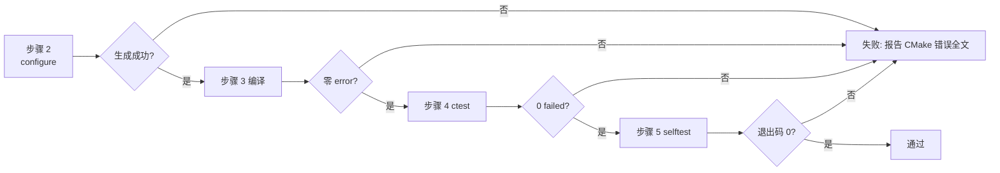

# Windows 编译测试任务描述

## 结论摘要

本任务在 **Windows + MSVC** 环境下对 picopaste 做首次真实编译与测试。截至本文档撰写时，该仓库的全部验证都在 Linux host 上完成；Windows 侧仅做过 mingw 交叉编译的**语法检查**，而 mingw 定义了 `__GNUC__` 并自带 POSIX 头，因此它**不能**证明 MSVC 可编译、更不能证明运行期行为。

本任务的意义正是补上这一块：它**预期会在首次运行时暴露问题**。暴露即成功，静默通过才需要怀疑。

## 一、前置条件

| 项 | 要求 |
|---|---|
| 编译工具链 | Visual Studio 2022（含 "Desktop development with C++"），或 VS Build Tools |
| CMake | 3.20 以上（MSVC 生成器 `-A x64`） |
| Git | 可访问 GitHub |
| OpenSSH 客户端 | `ssh.exe` 在 PATH 中（`--selftest` 的 sftp-reachability 项需要） |
| 本地 SSH 服务（可选） | 仅当希望集成测试真正执行而非跳过时需要 |

## 二、执行步骤

### 步骤 0：确认前置修复已落地

集成测试曾因三个测试文件无条件 `#include <unistd.h>` 并调用 `mkstemp` / `getpid` 而**无法在 MSVC 下编译**，Windows 构建会在测试目标处失败。修复落地后，`tools/check_posix_leak.cmake` 的扫描范围应已覆盖 `tests/`。

验证方式：本地 Linux 侧 `ctest` 中 `gate_posix_leak` 通过且其输出包含 `tests/` 路径计数。若未覆盖，先完成该修复再继续本节后续步骤。

### 步骤 1：获取依赖

```bat
git clone --branch windows https://github.com/DeguiLiu/newosp.git %USERPROFILE%\newosp-windows
```

newosp 必须用 **`windows` 分支**：`main` 上的 `osp/platform.hpp` 会把 `<windows.h>` 定义的 `RT_VERSION` 误判为 RT-Thread 标记，进而去包含不存在的 `<rtthread.h>`。该修复目前只存在于 `windows` 分支。

### 步骤 2：配置

```bat
cmake -S . -B build -A x64 ^
  -DPICOPASTE_BUILD_TESTS=ON ^
  -DPICOPASTE_WERROR=ON ^
  -DPICOPASTE_NEWOSP_DIR=%USERPROFILE%\newosp-windows
```

`PICOPASTE_NEWOSP_DIR` 必须显式传入：Windows 不保证 `HOME == USERPROFILE`，默认值可能落空。CI 的两个 job 也都显式传了它。

### 步骤 3：编译

```bat
cmake --build build --config Release
```

### 步骤 4：单元与集成测试

```bat
ctest --test-dir build -C Release --output-on-failure
```

### 步骤 5：能力自检

```bat
build\Release\picopaste.exe --selftest
```

必须在**终端**中运行：该程序是 GUI 子系统，自身没有控制台，靠 `AttachConsole` 挂到启动它的终端上；从资源管理器双击则输出无处可去，此时只有退出码是信号。

## 三、验收标准



| 步骤 | 通过判据 |
|---|---|
| configure | `-- Configuring done` / `-- Generating done` |
| 编译 | 退出码 0，**无 error**；`PICOPASTE_WERROR=ON` 下警告也视为失败 |
| ctest | `100% tests passed, 0 tests failed` |
| selftest | 每个能力打印一行 `PASS` / `FAIL` / `SKIP`，**退出码 0** |

`ctest` 中两项是机械门禁，不是单元测试，二者都必须通过且**必须各自能失败**（门禁从注入违规验证过，若它在本机恒通过，反而是需要排查的信号）：

- `gate_no_scripts`：源码中不得出现 VBS / cmd / PowerShell 外壳调用
- `gate_posix_leak`：Windows 可达路径不得引入 POSIX 头或符号

## 四、失败对照

| 症状 | 含义 |
|---|---|
| `cannot open include file: 'unistd.h'` | 测试或产品的平台守卫缺失（见步骤 0） |
| `LNK2019: unresolved external symbol WinMain` | 入口 TU 未加入目标（`src/platform/win32/main_win32.cpp`） |
| `<rtthread.h> not found` | 用了 newosp 的 `main` 分支而非 `windows` 分支 |
| `rt_kprintf was not declared` | 同上 |
| 集成测试显示 `SKIP` | 本机无可用 `ssh -s localhost sftp`，**属预期**，非失败 |
| `--selftest` 无任何输出 | 不是从终端启动；见步骤 5 |

## 五、本任务能证明什么、不能证明什么

**能证明**：MSVC（`/W4 /permissive- /utf8` + `/WX`）可编译；Windows 链接可达；主机侧单元测试在三平台一致；两个门禁在 Windows 路径下同样成立；`--selftest` 能报告真实能力与内存上限。

**不能证明**：

- **交互模式不可用**。托盘 / 热键 / 粘贴注入的主循环尚未接线，`picopaste.exe` 不带参数运行会明确报告"未接线"并以退出码 2 结束。这是刻意行为：启动一个静默无作为的守护进程，正是本项目要消灭的失败模式。
- **`--selftest` 覆盖不到真实上传链路**。端到端上传检查（`e2e`）当前报告 SKIP。
- **内存数字需实测**。设计承诺的稳态与硬上限（Job Object）由 `--selftest` 现场读数给出，本任务不做断言；若读数与设计不符，以读数为准。
- **单实例语义的会话范围**。互斥体名为 `Local\picopaste`，作用域是登录会话——这是刻意的，因为 Windows 剪贴板本身按会话隔离。跨会话行为不在本任务范围内。

## 六、风险提示

1. **MSVC 从未在此代码库上运行过。** 全部 Windows 侧证据止于 mingw 交叉编译的语法层面。首次编译出现错误属正常预期，应逐条记录而非就地绕过。
2. **门禁有已知边界。** `check_no_scripts` 本质是黑名单；`check_posix_leak` 的符号检测是标识符黑名单，其完备性来自头文件白名单。二者在源码里都写明了局限，不要据此推断"不存在问题"。
3. **`PICOPASTE_WERROR=ON` 下的第三方头。** 根 `CMakeLists.txt` 已为 vendored 头配置了 MSVC `/external:I` + `/external:W0` 与强制包含 shim，避免第三方警告变成构建失败。该路径同样未在真实 MSVC 上执行过。
