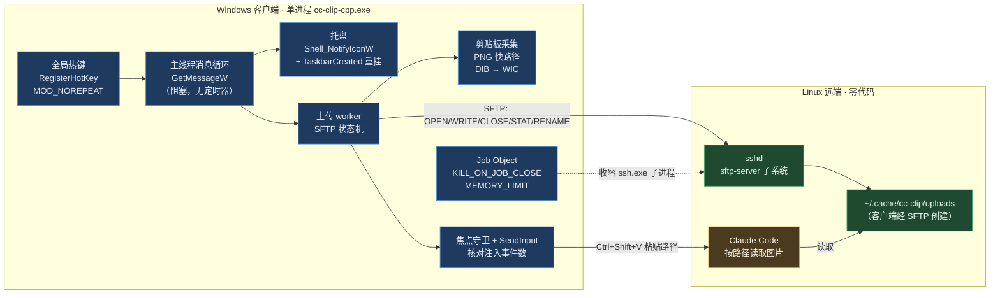
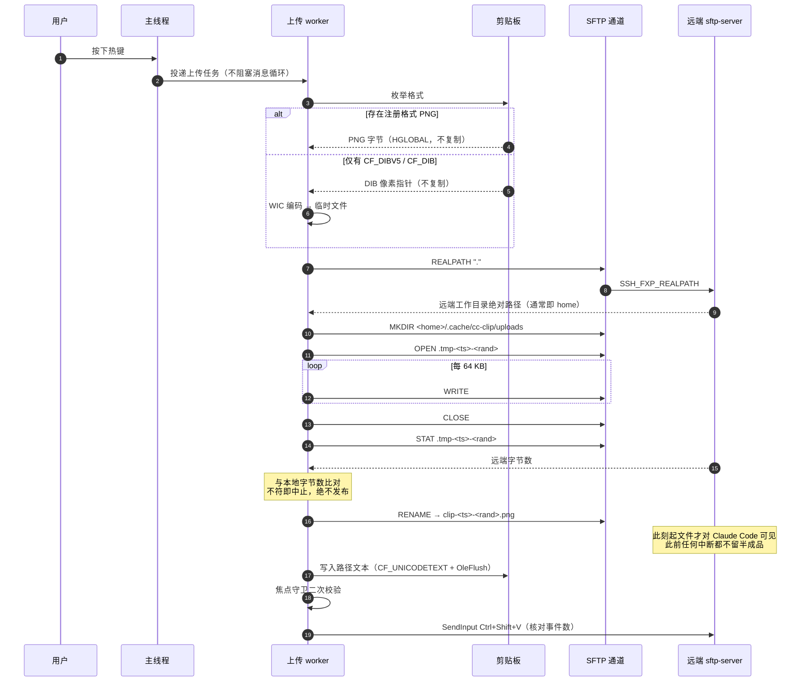

# cc-clip-cpp 设计文档

- 日期：2026-09-11
- 状态：待评审
- 目标仓库：`DeguiLiu/cc-clip-cpp`
- 参考实现：`DeguiLiu/cc-clip`（Go，v0.11.0；含分支 `windows-single-process`）

---

## 0. 结论摘要

用**一个 C++17 进程**替换 cc-clip 的整个 Windows 侧；**远端零代码**——不写服务端程序、不装 shim、不引入 OpenResty / Lua / ImGui / Python。

在通知方案 A（§8）成立的前提下，本设计**不修改 `~/.ssh/config`、不开任何监听端口**；若选方案 B，则需修改 ssh 配置并新增一个本地入站监听，该性质不再成立。

三条核心决策：

| 决策 | 选择 | 否决的替代方案 | 决定性理由 |
|---|---|---|---|
| 客户端语言 | C++17 + CMake + MSVC | LuaJIT + lua-win32 | 本需求第 2 条明文要求逻辑由 C++ 二进制承担；且 SFTP 编解码、WIC/COM、Job Object 这些硬骨头本来就必须在 C 层写 |
| 上传传输 | 常驻 SFTP 子系统通道（`ssh -s <host> sftp`），自实现 SFTP v3 编解码 | `scp` / `ssh 'cat >'` / OpenResty HTTP / trzsz | 零握手、零远端 shell 依赖、协议级尺寸校验与原子改名；OpenResty 会为一个不存在的服务引入服务端与进程；trzsz 是交互式终端协议 |
| 图片送达 | 上传后把**远端绝对路径**写入剪贴板，合成 Ctrl+Shift+V | xclip/wl-paste shim 注入字节 | 这是消掉远端 bash shim 的唯一途径；cc-clip 的 Windows 路径已验证此手法可行 |

架构图见 §2，上传时序见 §3，内存预算见 §5，失败模式对照见 §9。

**两处待你拍板**（§12）：通知回传选 A 事件流还是 B RemoteForward；v1 是否含通知。

---

## 1. 目标与设计约束

来自需求原文，逐条转成可验证的设计约束：

| # | 需求 | 设计约束 |
|---|---|---|
| 1 | 热键、上传、隧道端到端可用；失败立刻暴露，不许谎报成功 | 每一步有明确失败点与状态码；失败时**不写入剪贴板、不敲键**；不接受"进程已启动即成功" |
| 2 | 彻底去脚本 | 交付物中不存在 VBS / cmd / PowerShell / bash 文件；监督、重启、日志轮转全在进程内 |
| 3 | 极致省资源 | 空闲 CPU 为 0（非"接近 0"）；稳态内存 ≤ 12 MB，硬上限 32 MB；单进程 |
| 4 | 高可靠 | 内核级单实例；子进程随主进程必死；内存有内核强制上限；启动期可观测；退出无残留 |
| 5 | 贴合 tssh + RemoteForward 环境 | 默认**不修改** `~/.ssh/config`；确需修改时须时间戳备份 + 一条命令可回滚 |
| 6 | 交付闭环 | 源码 + newosp 补丁 + 回归测试，推送 `DeguiLiu/cc-clip-cpp` |

**明确的非目标（v1）**：Codex / opencode / Cursor 的字节级剪贴板注入；macOS / Linux 客户端；GUI 配置界面。

---

## 2. 架构



### 进程模型

单进程，四个线程，**全部在没有工作时阻塞在内核等待对象上，不设周期性轮询定时器**：

| 线程 | 职责 | 空闲时阻塞于 |
|---|---|---|
| 主线程 | Win32 消息循环：热键、托盘、菜单 | `GetMessageW` |
| 日志线程 | 从无锁 SPSC 环取记录，写盘并按大小轮转 | 信号量 |
| SFTP 读线程 | 阻塞读 ssh 子进程 stdout，分发 SFTP 响应 | `ReadFile` |
| 上传 worker | 执行上传状态机与粘贴注入 | 信号量 |

不在主线程做任何阻塞 I/O。热键触发只投递一个任务，消息循环永不卡住——这是"热键莫名失效"的一类根因。

---

## 3. 上传链路



### 通道建立

```
ssh -o ClearAllForwardings=yes -s <host> sftp
```

- `-s` 请求 sftp 子系统，stdin/stdout 即 SFTP 字节流。
- **认证、密钥、ssh-agent、known_hosts、`~/.ssh/config` 全部交由 OpenSSH**；本项目不实现 SSH，不接触凭据。
- 对 tssh / tsshd 同样成立：tsshd 从 sshd_config 解析 subsystem（其二进制含 `getSshdSubsystem`）。
- `ClearAllForwardings=yes` 确保不误触发用户配置中的转发。

### 需要实现的 SFTP v3 报文

`INIT` / `VERSION` / `REALPATH` / `MKDIR` / `OPEN` / `WRITE` / `CLOSE` / `STAT` / `RENAME` / `STATUS`，共 10 个 opcode。帧格式为 `uint32 长度 + uint8 类型 + 载荷`，大端序。无扩展协商需求。

### 为什么不用其它方案

| 方案 | 否决理由 |
|---|---|
| `scp` | OpenSSH 9.0+ 默认走 SFTP 子系统后，远端路径不再经 shell 展开，`~` 与引号语义失效（上游 `send.go:442` 的原始记录）。这是 `scp` 命令行的缺陷，不是 SFTP 协议的缺陷。 |
| `ssh 'cat > path'`（现状） | 依赖远端 sh / mkdir / umask / cat / wc / coreutils；需要 PATH prelude 补丁；需要手工 shell 引号与 `~` 展开；传输期间目标名已有半成品；四次独立握手。 |
| OpenResty HTTP | 为一个不存在服务端的需求引入服务端进程、端口、Lua 与配置，与第 2、3 条反向。 |
| trzsz（`trz`/`tsz`） | 终端流协议，为人工交互设计；自动化的热键路径需自行扮演本地端并处理 pty 与转义；远端引入 Python 包依赖，与"去脚本"冲突。保留为**人工**传输通道（已装在 `~/.local/bin`，零额外工作）。 |

---

## 4. 图片采集与粘贴注入

### 采集：两条路径，都不复制 DIB

1. **快路径**：注册剪贴板格式 `"PNG"` 存在时（浏览器截图、部分截图工具的默认行为），直接得到 PNG 字节。以 `GlobalLock` 锁定后**按 64 KB 分块流式读出**，内存占用 O(64 KB)，**零临时文件**。
2. **回退路径**：`CF_DIBV5`(17) 或 `CF_DIB`(8)。解析 `BITMAPINFOHEADER` 取宽高、位深、stride，用 WIC `CreateBitmapFromMemory` **直接指向 DIB 像素（不复制）**，编码器输出到临时文件（`SHCreateStreamOnFileEx`）；随后从临时文件分块读出。索引色（8bpp）加一层 `IWICFormatConverter`。

**绝不把 DIB 拷进自己的堆**：一张 4K 截图未压缩约 33 MB，一次复制就会击穿内存预算。这是本设计最重要的内存纪律。

编码用 WIC 而非自带 deflate/zlib：它是操作系统自带的编码器，无需向项目引入压缩库。

### 注入

1. 采集前台窗口句柄（焦点守卫基线）。
2. `OpenClipboard` / `EmptyClipboard` / `SetClipboardData(CF_UNICODETEXT)`，配 `OleSetClipboard` + `OleFlushClipboard` 使文本不依赖本进程存活。
3. 等待可配置延时（默认 150 ms）。
4. **二次校验前台窗口**；若已变化则**不敲键**，并按配置还原图片剪贴板。
5. `SendInput` 注入 6 个事件（Ctrl↓ Shift↓ V↓ V↑ Shift↑ Ctrl↑），注入前先经 `GetAsyncKeyState` 释放物理按下的 Alt / Win，**并核对 `SendInput` 返回值等于 6**。上游 issue #140 的教训是 WinForms `SendKeys` 会被 Electron/Chromium 终端忽略却仍返回成功——返回值核对是唯一能区分"真送达"与"谎报成功"的手段。
6. 按配置还原图片剪贴板。

---

## 5. 内存设计

需求强调"注意减少内存开销"，本章为此单独成节。

### 预算

| 项 | 目标 | 机制 |
|---|---|---|
| EXE + 静态 CRT 映像 | ≈ 0.4 MB | `/MT` 静态 CRT，单文件可拷贝 |
| 线程栈 | ≤ 0.5 MB | `_beginthreadex` 显式栈 256 KB（默认 1 MB × 4 = 4 MB，白扔 3 MB） |
| 堆 / 私有提交 | ≤ 6 MB | 启动期一次性分配，热路径**零动态分配** |
| 剪贴板 DIB | 0（不复制） | WIC 直接指向锁定的 HGLOBAL |
| PNG 缓冲 | 0 或 O(64 KB) | 快路径零缓冲；DIB 路径经临时文件 |
| 日志环 | 64 KB | `FixedVector` 静态容量 |
| SFTP 分块缓冲 | 64 KB | 单块静态复用 |
| 配置 | ≤ 16 KB | `FixedString<N>`，非 `std::string` |
| **稳态工作集目标** | **≤ 12 MB** | |
| **内核强制硬上限** | **32 MB** | Job Object `JOB_OBJECT_LIMIT_JOB_MEMORY`，超限即分配失败并报错，而非静默增长 |

### 为什么是 Job Object 而不是运行时限流

Go 版本用 `debug.SetMemoryLimit(32 << 20)` 拿到了硬上限，C++ 没有等价物，而 Job Object 提供的是**内核强制**的 commit 上限：越界不是"GC 更积极"，而是分配直接失败并产生可观测的错误。这正是第 4 条"运行时硬上限"的准确实现。

注意上限需覆盖 ssh 子进程（约 10 MB）。首次运行时由 `selftest` 实测基线后再校准，不拍脑袋写死。

### 可观测

`system_monitor` 周期（默认 60 s，可关）记录：私有提交、工作集、峰值、句柄数、线程数、SFTP 通道状态、成功/失败计数。**记录的是状态迁移与峰值，不是每次心跳**——上游曾因每 30 s 打一行健康检查失败日志把日志写到 25 MB。

### 空闲 CPU 为 0 的实现

不设周期性定时器。所有线程阻塞在 `GetMessageW` / `ReadFile` / `WaitForMultipleObjects` / 信号量上。健康状态由**事件驱动**得出（SFTP 管道 EOF、子进程退出、任何一次请求失败），而非轮询探测。

---

## 6. newosp 使用映射

### 使用

| 模块 | 承担 |
|---|---|
| `async_log.hpp` + `spsc_ringbuffer.hpp` + `log.hpp` | 日志：固定容量无锁环 + 后台线程 + 按大小轮转（需求 2 的"日志轮转在进程内"） |
| `hsm.hpp` / `service_hsm.hpp` | 生命周期状态机：`Init → Connecting → Ready → Degraded → Reconnecting → Stopping`；把监督与退避策略显式化、可单测 |
| `watchdog.hpp` + `thread.hpp` | 每个线程注册心跳；检测消息循环卡死、SFTP 线程僵死 |
| `breaker.hpp` | 通道熔断：连续失败后停止重试风暴，避免把断网变成 CPU 热点 |
| `mem_pool.hpp` | 固定块内存池：分块缓冲、日志节点；杜绝碎片与热路径动态分配 |
| `vocabulary.hpp` | `FixedString<N>` / `FixedVector<T,N>` / `expected<V,E>` / `optional<T>` / `NewType`：零堆配置与错误传递 |
| `config.hpp` + `toml.hpp` | 配置解析（热键、host、远端目录、延时、内存上限、日志级别） |
| `system_monitor.hpp` | 资源可观测（§5） |
| `shutdown.hpp` | 优雅退出与资源归位 |
| `process.hpp` / `shell_commands.hpp` | 子进程创建与收容（需 Windows 适配） |

### 不使用

`net.hpp` / `socket.hpp` / `event_loop.hpp` / `io_poller.hpp` / `transport.hpp` —— 这些是 epoll / kqueue 专属，Windows 不可用（`platform.hpp` 中 `OSP_HAS_NETWORK` 对 Windows 默认为 0）。本设计不需要通用网络栈：SFTP 走 ssh 子进程管道，无入站端口。

### 需要提交给 newosp 的补丁

精确位置（已核对）：

| 文件 | 位置 | 内容 | 处理 |
|---|---|---|---|
| `platform.hpp` | L149-150 | `OSP_LIKELY` / `OSP_UNLIKELY` 用 `__builtin_expect` | 加 `_MSC_VER` 分支（MSVC 上定义为恒等） |
| `platform.hpp` | L151-152 | `OSP_UNUSED` / `OSP_PRINTF_FMT` 用 `__attribute__` | MSVC 分支：`__declspec` 或置空 |
| `platform.hpp` | L306 | `__builtin_ia32_pause()` | MSVC 分支：`_mm_pause()` |
| `platform.hpp` | L308 | `asm volatile("yield" ::: "memory")` | MSVC 分支：`YieldProcessor()` |
| `mem_pool.hpp` | L60 / L63 | `OSP_TSAN_NO_RACE` 用 `__attribute__((no_sanitize("thread")))` | MSVC 上置空 |
| `bus.hpp` | L654 / L706 | `__builtin_prefetch` | 若引入 bus 则改为 `_mm_prefetch`；否则不需 |

`toml.hpp` 已有完整的 `_MSC_VER` / `TOML_HAS_BUILTIN` 分支，无需改动。这是好消息：补丁集中在 `platform.hpp` 一个中心头文件，改 4 处即可让整库具备 MSVC 能力。

---

## 7. 单实例、子进程收容与残留清理

| 需求 | 机制 |
|---|---|
| 任一时刻只有一个进程 | `CreateMutexW(L"Local\\cc-clip-cpp-<port>")` + `ERROR_ALREADY_EXISTS(183)`。句柄故意不关闭，由内核在进程退出时释放——这正是所需的生命周期语义。不依赖 PID 文件，不受陈旧文件、重复开机项、重复双击影响。 |
| 子进程绝不残留 | Job Object + `JOB_OBJECT_LIMIT_KILL_ON_JOB_CLOSE`。ssh.exe 子进程加入同一 Job，主进程无论正常退出还是崩溃，内核保证子进程一并终止。 |
| 启动前清理残留 | 在方案 A 下不存在监听端口（无 RemoteForward、无本地 HTTP 监听），因而也不存在"残留进程占端口"。单实例互斥已覆盖重复启动。若启动时发现互斥被占，**报告占用者 PID 与映像名后退出**，绝不擅自终止——避免误杀用户进程。 |
| 内存不泄漏 | §5 的固定分配纪律 + Job Object 硬上限 + `selftest` 报告的基线与峰值。 |

---

## 8. 通知回传（待定，见 §12）

两个方案，均不需要服务端程序：

**方案 A：事件流（推荐）**
Windows 持第二条常驻通道 `ssh <host> 'tail -F ~/.cache/cc-clip/events.jsonl'`；远端 Claude Code hook 仅需在 `settings.json` 中一行 `tee -a <该文件> > /dev/null`。
优点：不碰 ssh 配置、无入站端口、无 nonce、通道断开即管道 EOF **立刻可知**、无轮询。
代价：多一条常驻通道（第二个 ssh 子进程）。

**方案 B：RemoteForward（沿用已验证链路）**
保留上游 v0.11.0-single 的 `/notify` + nonce 机制，Windows 起本地 HTTP 监听。
优点：与现有部署一致。
代价：必须修改 `~/.ssh/config`（需显式 `127.0.0.1:<port>` 绑定以规避双栈 `::1` 陷阱）；需时间戳备份与 restore 子命令；无入站流量时无法区分"没有事件"与"转发已死"。

方案 A 更贴合第 1 条（失败立刻暴露）与第 5 条（不改 ssh 配置）。

### hook 注入的落盘方式

无论哪个方案，都需要在远端 `~/.claude/settings.json` 注入一条 hook。由**客户端经 SFTP 读写该文件**完成：读 → 合并（不覆盖用户已有条目）→ 写回，写入前生成时间戳备份，并提供 `restore` 子命令。全程无 shell、无 jq。

---

## 9. 失败模式对照

| 失败场景 | 上游 Go 实现 | 本设计 |
|---|---|---|
| 剪贴板无图 | 起 PowerShell 探测，报错含糊 | Win32 枚举格式，明确返回"无图" |
| 远端 home 解析失败 | 额外一次 ssh，SSH banner 污染 stdout（issue #80，需哨兵标记容错） | SFTP `REALPATH`，同连接内，无 banner 问题 |
| 上传中断 | 目标名上留半成品文件 | 临时名，未 `RENAME` 前不可见 |
| 上传内容损坏 | 多一次 `wc -c` 往返比对 | `STAT` 同连接比对 |
| 通道/隧道断开 | 无信号，用户只能靠"粘贴没反应"感知 | 管道 EOF 立即感知 → 托盘变红 + 日志 + 状态计数 |
| 转发绑定失败 | 仅 ssh stderr 警告，无人阅读（`ExitOnForwardFailure` 全库未设置） | 方案 A 下不存在转发 |
| 热键注册失败 | 父进程打印"已启动"并 exit 0 | `RegisterHotKey` 失败立即报错并返回非零 |
| 敲键被忽略 | `SendKeys` 谎报成功（issue #140） | `SendInput` 返回值必须等于 6 |
| 焦点漂移 | 有守卫 | 保留守卫 |
| 多实例 | PID 文件 + VBS 监督循环 | `CreateMutexW` 内核互斥 |
| 残留进程 | VBS 重启循环 + PID 文件 | Job Object `KILL_ON_JOB_CLOSE` |
| 托盘图标丢失 | 未处理 | 处理 `TaskbarCreated` 重新挂载 |
| 日志无限增长 | 无轮转，实测曾达 25 MB | 固定环 + 按大小轮转 |
| 内存增长 | Go GC，实测 commit 53 MB | 固定分配 + Job 硬上限 + 峰值可观测 |
| 每次粘贴开销 | 4 次 ssh 进程 + 3 次 PowerShell 进程 | 0 次进程、0 次握手 |

---

## 10. 验证策略

本机无 Windows，故"如何验证"本身是设计的一部分。

| 层 | 手段 | 在哪里执行 |
|---|---|---|
| 平台无关核（SFTP 编解码、上传状态机、配置、日志轮转、退避策略、HSM） | Catch2 + ASan / UBSan / TSan，TDD，覆盖率 ≥ 80% | **本机 Linux**，可完全闭环 |
| SFTP 客户端 | 对本机真实 `/usr/lib/openssh/sftp-server` 跑集成测试：分包、分块、`STAT` 校验、`RENAME` 原子性、各类错误码 | **本机 Linux** |
| win32 层编译正确性 | `zig c++ -target x86_64-windows-gnu` 交叉编译门禁，抓 `windows.h` / `wincodec.h` 签名与结构体对齐问题 | 本机 |
| MSVC 编译正确性 | GitHub Actions `windows-latest` 作业 | CI |
| win32 运行行为 | 客户端内置 `selftest`：逐项自检剪贴板读图 / WIC 编码 / SendInput 注入数 / 热键注册 / 单实例互斥 / SFTP 连通 / 内存基线，输出通过表 | **你在 Windows 一条命令** |
| 端到端 | `selftest --e2e`：真实上传一个合成图并回读校验 | 你在 Windows |

关键点：**架构中风险最高的 SFTP 编解码，恰好是唯一能在本机端到端真实验证的部分。**

---

## 11. 交付物与里程碑

**交付物**
1. `DeguiLiu/cc-clip-cpp`：CMake 工程，C++17，MSVC 与 GCC/Clang 双构建。
2. newosp MSVC 兼容补丁（§6 表格，6 处）。
3. 回归测试套件（Catch2 单测 + SFTP 集成测试）。
4. GitHub Actions：Linux 测试 + Windows MSVC 构建。
5. 文档：本设计 + README（安装、免密认证前提、`selftest`、故障排查、回滚）。

**里程碑**

| M | 内容 | 完成判据 |
|---|---|---|
| M1 | 工程骨架 + newosp 补丁 + 双平台构建通过 | Linux 与 MSVC 均能构建出 exe |
| M2 | SFTP v3 编解码 + 对本机真实 sftp-server 的集成测试 | 上传/校验/原子改名测试全绿 |
| M3 | win32 层：剪贴板采集 + WIC + SendInput + 焦点守卫 | `selftest` 各项通过（Windows） |
| M4 | 单实例 + Job Object + 托盘 + 热键 + 日志轮转 + HSM 监督 | 长跑无增长、无残留、空闲 CPU 为 0 |
| M5 | 端到端打通 + hook 注入与回滚 + 文档 | 热键粘贴可用；失败路径均有明确报错 |

---

## 12. 待确认决策

1. **通知回传**：方案 A 事件流（推荐，不改 ssh 配置），还是方案 B RemoteForward（沿用已验证链路）？
2. **v1 范围**：是否包含通知？或先只做"热键 → 上传 → 粘贴"这一条主干？

**已确认的前提（若假设有误请指出）**
- 常驻后台通道需要免密认证（ssh-agent 或免密密钥）；否则需 `login` 子命令手动预热一次。
- 上传目录沿用 `~/.cache/cc-clip/uploads`。
- 远端 SFTP 子系统缺失时，**不做第二条上传代码路径**，而是给出可操作的报错。

---

## 13. 附：上游协议设计评估摘要

评估结论支撑了"不兼容上游协议"的决策，摘要如下：

- 最严重的问题是**同一功能两端两套传输**：macOS/Linux 走 HTTP over RemoteForward 把字节流进 xclip shim，Windows 走 ssh 上传 + 路径粘贴。两套失败模式、两拨 bug。
- shim 依赖 argv 字符串模式匹配与 PATH 优先级，是脆弱设计；远端无真 xclip 时失败退化为误导性的 exit 127。
- `/clipboard/type` 与 `/clipboard/image` 分两步，存在固有 TOCTOU 竞态，上游以"空响应即 fallback"打补丁。
- 认证双轨（Bearer token + nonce），nonce 存于内存，daemon 重启即静默失效且无重试。
- **协议在关键方向上没有失败信号**：本地无法得知远端转发已死；`ExitOnForwardFailure` 全库未设置，健康检查仅在 `connect` 时执行一次。这是"断了不自知"的协议级根因。
- 无线上协议版本与能力协商。
- 值得保留的两点：分段退出码（区分"应 fallback"与"应硬失败"）；健康探测要求服务身份匹配而非仅 TCP 连通。

本设计保留了上述两点精神（每步明确状态、通道身份可辨），并消除了其余各项的成因。
