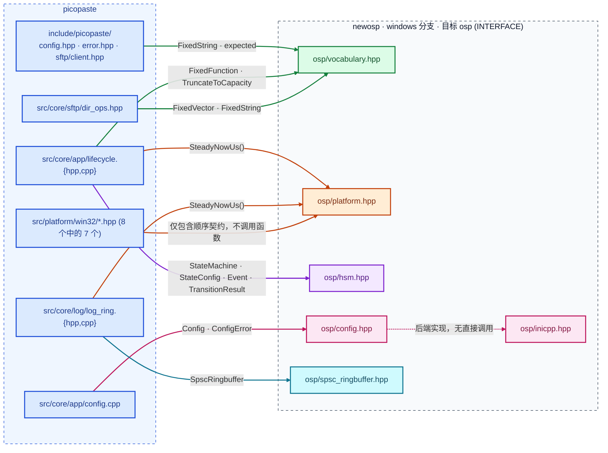

# picopaste 对 newosp 的依赖

newosp 以 **in-tree 子项目**引入（`add_subdirectory(..., EXCLUDE_FROM_ALL)`），picopaste 链接其唯一目标
`osp`（`add_library(osp INTERFACE)`，纯头文件、无库文件）。代码层依赖 **5 个头文件** + 1 个后端实现。

## 一、依赖与调用关系



| newosp 文件 | 引入点 | 用到的名字与使用方式 |
|---|---|---|
| `osp/vocabulary.hpp` | 8 | **词汇层，依赖最广。** `FixedString<N>` 承载全部跨模块字符串（配置五项、`sftp/client.hpp:26` 的 `Path`、`upload_pipeline.hpp:44,98` 路径、`clipboard.hpp:49,53`、`hotkey.hpp:34`），把内存上限变成类型约束而非运行期检查；`TruncateToCapacity` 是 `assign` 的"截断而非溢出"标签（十余处：`config.cpp:57`、`upload_pipeline.cpp:135/180/258`、`client.cpp:359/905`、`clipboard.cpp:509/511/702`、`hotkey.cpp:206`、`hook_install.cpp:51`、`main_win32.cpp:238`）；`FixedVector` 用于目录项与待删下标（`client.hpp:74`、`dir_ops.hpp:30`、`dir_ops.cpp:93`）；`expected` 只在 `error.hpp:65,67` 出现一次并收敛出 `Result`/`Status`，全项目不再直接碰它——换错误实现只动一个文件；`FixedFunction` 是 `lifecycle.hpp:61` 的 `ClockFn`，测试以假时钟替换真实时基。 |
| `osp/platform.hpp` | 8 | **时基 + 包含顺序契约。** 真实调用只有 `osp::SteadyNowUs()`（`lifecycle.cpp:57` 状态机时钟、`log_ring.cpp:16` 日志时间戳）。7 个 win32 头文件包含它，用的是**包含顺序**这一副作用：它靠 `RT_VERSION` 判定 RT-Thread，而 `<windows.h>` 也定义 `RT_VERSION`；若 windows.h 先进入 TU，newosp 会误判并去包含不存在的 `<rtthread.h>`，编译直接失败。故这些头一律把它放在 `#include <windows.h>` 之前（`single_instance.hpp:25-29` 有注释）。**不要因为"没调用 osp 函数"就删掉它**——那只会换来 `rtthread.h not found`。 |
| `osp/hsm.hpp` | 1 | `lifecycle.hpp:19`。`StateMachine<Context,7>`（`lifecycle.hpp:112`）、`StateConfig` 状态表（`lifecycle.cpp:44`）、`Event`（`:73`，`Dispatch` 的唯一入参）、`TransitionResult`（24 处 handler 返回 `kHandled`/`kUnhandled`）——7 个 handler 覆盖 Init→Connecting→Ready→Degraded→Reconnecting→Stopping→Stopped。 |
| `osp/config.hpp` | 1 | `config.cpp:20`。`Config<IniBackend>`（`:31`）、`ConfigError::kFileNotFound`（`:223`）区分"文件不存在"（可回退默认值）与"存在但解析失败"（必须暴露）。后端由 CMake 的 `PICOPASTE_CONFIG_FORMAT`(`ini|toml`) 二选一，`ini` 为默认，解析器是 newosp 自带的 `inicpp.hpp`；换配置格式不改 C++ 代码。 |
| `osp/spsc_ringbuffer.hpp` | 1 | `log_ring.hpp:21` 引入，`:164` `std::array<SpscRingbuffer<LogRecord, kLogRingDepth>, kLogProducerCount>`：每生产者一条独立环，写侧不分配、不加锁、不阻塞调用者——这是"空闲 CPU 近零、内存 <20MB"能成立的前提。 |
| `osp/inicpp.hpp` | 间接 | 被 `Config<IniBackend>` 使用，无直接调用；`CMakeLists.txt:28-29` 注明 "INI ships vendored in newosp"。 |

## 二、构建层契约

```cmake
add_subdirectory("${PICOPASTE_NEWOSP_DIR}" "${CMAKE_BINARY_DIR}/newosp" EXCLUDE_FROM_ALL)
target_link_libraries(picopaste_core PUBLIC osp PRIVATE picopaste_msvc_crt)
```

1. **必须 `windows` 分支，不能用 `main`**：`main` 上 `RT_VERSION` 误判会让 Windows 构建去找 `<rtthread.h>`（`CMakeLists.txt:33-45`）。
2. **newosp 路径必须显式传入**（`-DPICOPASTE_NEWOSP_DIR=`）：Windows 不保证 `HOME == USERPROFILE`。
3. **第三方警告与 `/WX` 隔离**：vendored 头以 `/external:I` + `/external:W0` 声明为外部，再由强制包含的 shim 拉入；`picopaste_msvc_crt` 另行提供 `_CRT_SECURE_NO_WARNINGS`。缺这层隔离，newosp 的警告会变成构建失败。
4. `osp` 是 INTERFACE 目标，只传播头文件与宏，不产生库文件。


