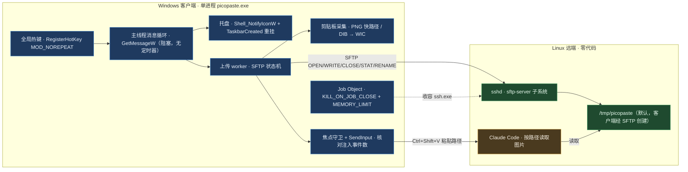
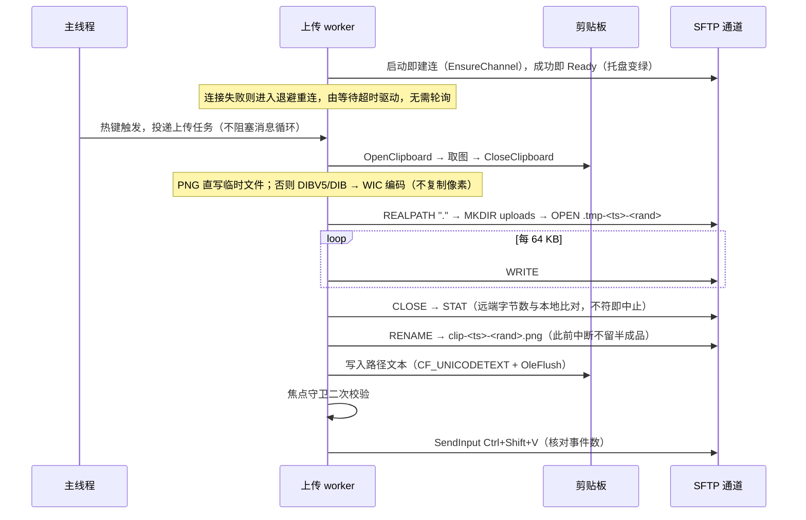
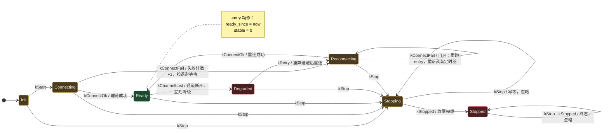

# picopaste 设计文档

- 硬约束：必须使用 newosp；状态机必须使用 newosp 的实现；允许在 newosp 新建 `windows` 分支
- 依赖细节不在此重复：**见《newosp-dependency.md》**

## 一、概述

你在 Windows 上截完图，按一下热键，图片就会被传到 Linux 服务器上，并在光标处自动粘贴出这张图的远端路径——
Claude Code 按这个路径就能读到图。

整个方案只有**一个 Windows 进程**，**远端不需要装任何东西**（用 sshd 自带的 sftp 子系统就够了），
默认也不修改 `~/.ssh/config`、不开任何监听端口。

| # | 需求 | 设计约束 |
|---|---|---|
| 1 | 端到端可用；失败立刻暴露，不许谎报成功 | 每步有明确失败点与状态码；失败时**不写剪贴板、不敲键**；不接受"进程已启动即成功" |
| 2 | 彻底去脚本 | 交付物无 VBS / cmd / PowerShell / bash 文件；监督、重启、日志轮转全在进程内 |
| 3 | 极致省资源 | 空闲 CPU 为 0（非"接近 0"）；稳态内存 ≤ 12 MB；硬上限 256 MB（须容纳取图时 Windows 拷进本进程的整张图）；单进程 |
| 4 | 高可靠 | 内核级单实例；子进程随主进程必死；内存有内核强制上限；启动期可观测；退出无残留 |
| 5 | 贴合 tssh + RemoteForward 环境 | 默认**不修改** `~/.ssh/config`；确需修改时须时间戳备份 + 一条命令可回滚 |
| 6 | 交付闭环 | 源码 + newosp 补丁 + 回归测试，推送 `DeguiLiu/picopaste` |

非目标（v1）：给 Codex / opencode / Cursor 做字节级剪贴板注入；macOS / Linux 客户端；图形配置界面。

## 二、架构与上传链路



进程里有四个线程，**没有工作时全部睡在内核等待对象上**，不设轮询定时器——这就是"空闲 CPU 为 0"的实现方式：

| 线程 | 干什么 | 闲着时睡在哪 |
|---|---|---|
| 主线程 | Win32 消息循环：热键、托盘、菜单 | `GetMessageW` |
| 日志线程 | 把日志写盘，按大小轮转 | 信号量 |
| SFTP 读线程 | 阻塞读 ssh 子进程的 stdout，分发 SFTP 响应 | `ReadFile` |
| 上传 worker | 执行上传与粘贴注入 | 信号量 |

主线程**不做任何阻塞 I/O**：热键按下只是投递一个任务，消息循环永不卡住——"热键莫名其妙失效"通常就是这么来的。

日志用**每条会写日志的线程各一个无锁环**，而不是共用一个环：无锁队列的前提是"只有一个写者"，
而主线程、SFTP 读线程、上传 worker、日志线程自己都会写日志，共用一个环就是数据竞争。
代价只是排空时多转几圈。



**通道怎么建**：`ssh -o ClearAllForwardings=yes -s <host> sftp`。

- `-s` 表示请求 sftp 子系统，ssh 的 stdin/stdout 就是 SFTP 字节流，**不经过远端 shell**。
- 认证、密钥、ssh-agent、known_hosts、`~/.ssh/config` **全部交给 OpenSSH**——本项目不实现 SSH，不接触任何凭据。
- `ClearAllForwardings=yes` 保证不会误触发用户 ssh 配置里的端口转发。
- 对 tssh / tsshd 同样成立（tsshd 从 sshd_config 解析 subsystem）。

**为什么自己实现 SFTP v3，而不是 `scp` 或 `ssh 'cat >'`**：

- `scp` 在 OpenSSH 9.0+ 默认走 SFTP 子系统，远端路径不再经过 shell 展开，`~` 和引号会失效；
- `ssh 'cat > path'` 依赖远端的 sh / mkdir / cat / wc 等一堆命令，还得手工处理引号，传输期间目标文件名上就已经有半成品；
- SFTP 只需要 10 个报文，每一步都能拿到明确的成功/失败码，还能在同一条连接里比对字节数、原子改名。

用到的报文共 10 个：`INIT`、`VERSION`、`REALPATH`、`MKDIR`、`OPEN`、`WRITE`、`CLOSE`、`STAT`、`RENAME`、`STATUS`
（远端清理功能再加 `OPENDIR`、`READDIR`、`REMOVE`）。帧格式是 `uint32 长度 + uint8 类型 + 载荷`，大端序。

**实现远端时要注意三件事**（在本机对真实 sftp-server 实测得到）：

1. **`RENAME` 不是覆盖语义**：改名到已存在的目标会返回 `FAILURE(4)`（OpenSSH 内部用 `link()` + `unlink()`，
   `link()` 遇到已存在目标就失败）。所以"写临时名再改名覆盖"这种原子写法在 SFTP 上不成立。上传截图没影响
   （目标名是新的），但**回写配置文件时不能用它**。
2. **`MKDIR` 遇到已存在的目录返回 `FAILURE(4)`**：客户端要把 code 4 当作"已存在，继续"，否则第二次运行就会失败。
3. **`STAT` 的属性字段要按位解析**：属性里有一个 `flags` 位掩码，`size` 只在对应位置位时才存在；按固定偏移取会读到垃圾值。

## 三、采集、注入与资源设计

**图片怎么取（统一走临时文件）**：`OpenClipboard` → 立刻取图转成临时文件 → `CloseClipboard`，持锁只有几百毫秒。

- 剪贴板里是注册格式 `"PNG"` → 直接把 PNG 字节写进临时文件；
- 只有 `CF_DIBV5` / `CF_DIB` → 解析 `BITMAPINFOHEADER` 拿宽高与行距，用 WIC 编码成 PNG 写进同一个文件（索引色走格式转换）；
- 之后上传从临时文件按 64 KB 分块读，与剪贴板状态完全解耦，传完删除。

**取图的内存账要算两笔**。第一笔：`GetClipboardData` 交回来的块是**在调用进程里**落地的
（跨进程剪贴板数据要复制进读方地址空间），所以读一张 4K 截图的 DIB 就在本进程里多出约 33 MB——
Job Object 的上限必须覆盖它，否则 `GetClipboardData` 直接返回 NULL，而格式探测却是成功的，
于是失败被显示成"剪贴板里没有图片"。默认上限因此是 256 MB，不是按稳态占用算出来的 32 MB。
第二笔：取图时**只认 `EnumClipboardFormats` 列出的格式**，不用 `IsClipboardFormatAvailable`——后者回答的是
"能不能拿到"，会把 Windows 需要现场合成的格式也算作可用（放一张 27 MB 的 `CF_DIB` 上去，它会声称
`CF_DIBV5` 也可用），而那一份合成出来的块又是一整张图的拷贝。顺序上先试真实存在的 `CF_DIBV5`，再试
`CF_DIB`；只在只有 `CF_BITMAP`（没有 DIB 块）时才接受一次合成，因为那是读这种剪贴板的唯一办法。
取不到任何一个块时返回 `kClipboardReadFailed`，不再谎报"没有图片"。

为什么不能"零拷贝、直接在剪贴板上传"：上传可能要好几秒，那样就得在整个上传期间占着剪贴板不放
（别的程序复制会失败），而且剪贴板所有者随时可能被替换，指针随时失效。落一次临时文件只多一次磁盘写
（4K 截图 PNG 约 2–8 MB），换来恒定 64 KB 的读取缓冲和可预测的内存上界。
**绝不把未压缩的 DIB 拷进自己的堆**——一张 4K 截图未压缩约 33 MB。

**怎么粘贴**：① 记下当前前台窗口；② 把远端路径写进剪贴板（`CF_UNICODETEXT` + `OleFlush`，让文本不依赖本进程存活）；
③ 等一小段可配置延时（默认 150 ms）；④ **再看一眼前台窗口**，如果已经变了就**不敲键**并还原图片剪贴板；
⑤ `SendInput` 发 Ctrl↓ Shift↓ V↓ V↑ Shift↑ Ctrl↑（发之前先把物理按住的 Alt/Win 放开），**并核对返回值**；
⑥ 按配置还原图片剪贴板。核对返回值是唯一能区分"真送达"和"假装成功"的办法——有的终端会把注入的按键直接忽略，
调用却仍然返回成功。

**内存预算**：

| 项 | 目标 | 怎么做到 |
|---|---|---|
| EXE + 静态 CRT | ≈ 0.4 MB | `/MT` 静态链接，单文件即可拷贝运行 |
| 线程栈 | ≤ 0.5 MB | 显式指定 256 KB（默认每线程 1 MB 是白扔）。注意 SFTP 客户端自带约 82 KB 收发缓冲，必须是长生命周期成员，不能放栈上 |
| 堆 / 私有提交 | ≤ 6 MB | 启动期一次性分配，热路径**零动态分配** |
| 图片缓冲 | 0 或不复制 | WIC 直接指向锁定的剪贴板内存；走临时文件时不额外缓冲；分块缓冲 64 KB 复用 |
| 日志环 / 配置 | 64 KB / ≤ 16 KB | 定长容器，不用 `std::string` |
| **稳态私有提交** | **≤ 12 MB** | 实测：启动后 9.8–11.9 MB（通道在启动即建立，空闲期就是建链后的数字） |
| **稳态工作集** | **≤ 40 MB** | 含共享 DLL 页。实测：建链后 28–37 MB |
| **硬上限** | **256 MB** | Job Object 的内核强制 commit 上限。它不是稳态占用，而是要覆盖"取图时整张图被复制进本进程"这一瞬时峰值；空闲与建链后的实测值仍是上面的 12 MB / 40 MB |

**为什么用 Job Object 做内存上限**：它是内核强制的。超过上限时不是"程序变慢"或"GC 更勤快"，
而是**分配直接失败并报错**——这正是"内存必须有硬上限"想要的行为。上限要覆盖 ssh.exe 子进程，
还要覆盖读一张图时被复制进来的一整份 DIB，所以实际数字需要在目标机器上实测后再校准。

**空闲 CPU 为 0 的准确含义**：不是"什么都不做"，而是**不忙等**。空闲时进程里**没有任何定时器**——
不存在 `CreateWaitableTimerEx`，也没有周期性的心跳或资源采样。四个线程全部阻塞在内核等待对象上：
主线程在 `GetMessageW`，日志线程与上传 worker 在各自的信号量上，SFTP 读线程在管道的 `ReadFile` 上。
worker 在启动时即执行一次 `EnsureChannel()` 建立通道（见上面的时序图），此后它的等待是
`WaitForMultipleObjects({唤醒事件, ssh 子进程句柄})`：链路正常时超时是 `INFINITE`
（真正无限等待，不轮询）；只有在需要退避重连时才用 `RetryDelayMs()` 当超时，让重连由这次等待本身驱动。

因此健康判定**完全由事件驱动**，没有采样参与：管道 EOF、ssh 子进程退出、任一请求失败。
实测空闲 85 秒，CPU 时间在启动抖动结束后**完全平**——因为确实一次都不会醒，所以"为 0"是字面意义的 0，
不是"接近 0"。内存基线由 `--selftest` 一次性采样，不做周期采样。

（这段曾经写着"心跳与资源采样各由一个计时器唤醒（60 s / 1 s）"。**代码里从来没有这两个计时器**，
已按实测改正。要加周期采样就得同时放弃"空闲 CPU 为 0"这条承诺，那是另一个取舍。）

**单实例、收容与残留清理**：

| 需求 | 机制 |
|---|---|
| 同时只能有一个实例 | 创建一个命名互斥体（`Local\picopaste`），已存在就直接退出。不靠 PID 文件，所以不怕关机残留、重复双击、开机项重复 |
| 子进程不会变孤儿 | ssh.exe 放进 Job Object 并设 `KILL_ON_JOB_CLOSE`；主进程无论是正常退出还是崩溃，内核都会连带终止它 |
| 互斥体被占用时怎么办 | **报告占用者的 PID 与程序名后退出，绝不擅自结束别人的进程** |
| 退出不留残留 | 托盘图标注销、互斥体由内核释放、临时文件删除 |

**通知怎么回传（设计已定，尚未接线）**：Windows 侧再开一条常驻通道 `ssh <host> 'tail -F <events.jsonl>'`，
远端 Claude Code 的 hook 只要往那个文件里追加一行就行。通道断开时管道 EOF 会**立刻**被感知，
不需要轮询，也不用开监听端口。

需要注意：**回写远端的 `~/.claude/settings.json` 不能用"临时名 + 改名覆盖"**（见 §二第 1 条），
而是截断覆盖写入，并在写之前先存一份带时间戳的备份。

**当前真实状态**：这条通道**代码里一行都没有**（`tail -F` / `events.jsonl` 全树搜不到）；
`~/.claude/settings.json` 的改写逻辑在 `src/core/app/hook_install.*` 里**实现完整且有单元测试**，
但 `main_win32.cpp` 不包含它、也没有任何命令行入口能到达它——**运行时从不调用**。
两件都按"已设计、未接线"记，不要当成可用功能。

**为什么截图默认放 `/tmp`**：`/tmp` 一般会随重启被系统清掉，用户不必自己收拾。默认值是固定的 `/tmp/picopaste`，
由客户端经 SFTP 创建，随时可以改 `remote_dir` 换到别处。需要注意 `/tmp` 是**全局可写**的共享目录，
多用户主机上建议把 `remote_dir` 指向带用户名的子目录（如 `/tmp/picopaste-<你的用户名>`），
避免互相覆盖或读到别人的截图。目录存久了还是会涨，所以远端清理功能仍然要做。

## 四、失败模式与验证策略

**通道健康由一台 7 个状态的状态机管理**（newosp `osp/hsm.hpp` 的 `StateMachine<Context, 7>`，
静态表驱动、无 vtable、状态数与转移表在编译期固定）。它存在的唯一理由就是**让失败可见**：
通道一断，Ready 立刻转 Degraded，托盘当场变红，不需要等用户自己发现"粘贴怎么不好使了"。



状态机本身不认识颜色，托盘颜色是**查出来的**：Ready 绿；Degraded 与 Stopped **红**
（通道死了要显眼，不许藏）；Init / Connecting / Reconnecting / Stopping 黄。

**完整转移表**（事件是 7 个：`kStart`、`kConnectOk`、`kConnectFail`、`kChannelLost`、`kRetry`、`kStop`、`kStopped`）：

| 当前状态 | 事件 | 下一个状态 | 动作 |
|---|---|---|---|
| Init | `kStart` | Connecting | — |
| Init | `kStop` | Stopping | — |
| Connecting | `kConnectOk` | Ready | `connect_ok_count++` |
| Connecting | `kConnectFail` | Reconnecting | `connect_fail_count++`、`attempt++`、按 `(attempt, stable)` 算退避 |
| Connecting | `kStop` | Stopping | — |
| Ready | `kChannelLost` | Degraded | `channel_lost_count++`；`stable = now − ready_since`；`stable ≥ 3 分钟` 则 `attempt = 0`；按 `(attempt, stable)` 算退避 |
| Ready | `kConnectFail` | Degraded | `connect_fail_count++`；worker 在上传失败时已先断开通道，与 `kChannelLost` 同样降级。否则 `kUploadTimeout` 等失败会被当作 unhandled，托盘在真实失败后仍是绿色 |
| Ready | `kStop` | Stopping | — |
| Degraded | `kRetry` | Reconnecting | 按 `(attempt, stable)` 算退避 |
| Degraded | `kStop` | Stopping | — |
| Reconnecting | `kConnectOk` | Ready | `connect_ok_count++` |
| Reconnecting | `kConnectFail` | Reconnecting | `connect_fail_count++`、`attempt++`、按 `(attempt, 0)` 算退避；**自环**重跑 entry，让监督定时器重新武装 |
| Reconnecting | `kStop` | Stopping | — |
| Stopping | `kStopped` | Stopped | — |
| Stopping | `kStop` | 不变 | 幂等，已处理 |
| Stopped | `kStop` / `kStopped` | 不变 | 终态，已处理 |
| 其余 (状态, 事件) | — | 不变 | 记为 unhandled 并计数，**不静默丢弃** |

**退避策略**是一个纯函数，测试可以不开真实时钟就跑完整个 5 s → 60 s 的爬升：
第 n 次连续失败等 `min(5 s × 2^(n−1), 60 s)`。只要 Ready 稳定撑过 **3 分钟**，
`attempt` 就清零——链路"挣回"一次从 5 s 重新开始的机会，避免偶发抖动把退避一路推到 60 s。

**幂等与终态**：Stopping 再收 `kStop`、Stopped 再收任何停止类事件，都只是"已处理"，
不产生自环之外的副作用；只有 `kStopped` 才把 Stopping 推到终态 Stopped。

**任何失败都会有一个明确的表现**，不会出现"看起来成功了其实没有"：

| 情况 | 你会看到什么 |
|---|---|
| 剪贴板里没有图 | 明确报"无图"，不写剪贴板、不敲键 |
| 远端目录 / home 取不到 | 同一条连接内的 `REALPATH` 报错，不额外起 ssh、也不做第二次尝试 |
| 上传中断 | 远端只留 `.tmp-` 临时名，Claude Code 看不到半成品；本地报错 |
| 传输出错（字节数不符） | `STAT` 比对不一致立即中止，**绝不发布** |
| 通道断开 / ssh 子进程退出 | 立刻感知（管道 EOF），托盘变红 + 写日志 + 失败计数 +1 |
| 远端静默（连接不断、既无 EOF 也无回复） | `upload_timeout_ms` 到期后按失败处理：返回独立错误码 `kUploadTimeout`、释放单飞、计数 +1，并走与通道断开相同的降级路径让托盘变红、自动重连 |
| 热键被别的程序占用 | 注册失败立即报错并返回非零退出码，不假装"已启动" |
| 自动粘贴被终端忽略 | 核对 `SendInput` 返回值，不符即报错 |
| 粘贴前焦点被切走 | 二次校验发现窗口变了，就不敲键 |
| 连按热键 | 同一时刻只允许一个上传，重复触发返回"忙" |
| 托盘图标被 Explorer 重启弄丢 | 收到 `TaskbarCreated` 消息自动重新挂上 |
| 日志无限增长 | 固定容量无锁环（进程内）。落盘与轮转已实现但**尚未接线**，当前不产生日志文件 |
| 内存异常增长 | 固定分配纪律 + Job Object 硬上限，越界直接失败报错 |
| 进程意外退出 | Job Object 连带终止 ssh.exe，不留孤儿进程 |

**自检**：`picopaste.exe --selftest` 会逐项检查本机能力——剪贴板读图、WIC 编码、`SendInput` 注入、
热键注册、单实例互斥、Job Object 上限、内存基线、SFTP 连通性——每项打印 `PASS` / `FAIL` / `SKIP`，
全部通过时退出码为 0。它同时也是内存基线的唯一实测来源。端到端上传项目前报告
`SKIP（not implemented in this build）`，尚未接线。

## 五、配置文件

配置文件是 INI 格式，用 `--config <路径>` 指定；**不指定时用 exe 同目录下的 `picopaste.ini`**。
两种情况都**不要求文件真的存在**：找不到就用内置默认值继续运行（并提示用的是默认值），所以你可以只写需要改的那几行。`;` 或 `#` 开头是注释。

```ini
[picopaste]

; 远端主机，形如 user@host。默认为空，必须自己填。
host = user@example.com

; 图片传到远端的哪个目录。目录由客户端经 SFTP 创建，不需要手工建。
remote_dir = /tmp/picopaste

; 触发上传的全局热键。
hotkey = alt+shift+v

; 用哪个 ssh 客户端；装了 tssh 之类可以换成它。
ssh_command = ssh

; 日志级别与轮转。
log_level = info
log_max_bytes = 8388608
log_keep_files = 2

; 写入剪贴板后、敲 Ctrl+Shift+V 之前等待的毫秒数。
delay_ms = 150

; 单次上传允许存活的最长时间（毫秒）。超过即按失败处理：返回独立错误码、
; 释放单飞、计数并让托盘变红。0 表示不设上限。
upload_timeout_ms = 30000

; 粘贴完成后是否把图片剪贴板还原回去。
restore_clipboard = true

; 是否发送桌面通知。只在右下角弹气泡，不弹任何模态对话框。
; 只在**状态变差的那一刻**弹一次（从正常掉到异常/过渡态），不是每次健康上报都弹——
; 否则失败会变成噪音。设为 false 就完全不弹，只靠托盘颜色。
notify_enabled = true

; 单张图片大小上限（20 MB），超过直接报错而不是试着传。
max_image_bytes = 20971520

; 内核强制内存上限（256 MB）。这不是稳态占用（空闲约 12 MB），而是为了覆盖
; "取图时 Windows 把整张图复制进本进程"的瞬时峰值：一张 4K 截图未压缩约 33 MB，
; 上限若小于它，GetClipboardData 会直接返回 NULL，热键看上去就像失灵。
job_memory_limit_mb = 256
```

各键的含义与默认值：

| 键 | 默认值 | 含义 |
|---|---|---|
| `host` | 空 | 远端主机（`user@host`）。**必填**，为空则无法建立通道 |
| `remote_dir` | `/tmp/picopaste` | 截图存放目录。绝对路径按原样使用，`~/` 开头由远端 sftp-server 解析为家目录。多用户主机建议改成 `/tmp/picopaste-<你的用户名>` |
| `hotkey` | `alt+shift+v` | 全局热键，例如 `ctrl+alt+p`。**必须可改**——该组合键可能已被别的程序占用 |
| `ssh_command` | `ssh` | ssh 客户端可执行文件名 |
| `log_level` | `info` | 日志级别 |
| `delay_ms` | `150` | 写剪贴板到敲键之间的等待毫秒数 |
| `upload_timeout_ms` | `30000` | 单次上传的最长存活时间（毫秒）。是对端静默（无 EOF 也无回复）时唯一的出路；到期按失败处理并释放单飞。`0` 关闭该上限 |
| `restore_clipboard` | `true` | 粘贴后是否还原图片剪贴板 |
| `notify_enabled` | `true` | 是否发桌面通知。只弹右下角气泡（无模态框），且只在**状态变差的那一刻**弹一次 |
| `max_image_bytes` | `20971520` | 单张图上限（20 MB） |
| `job_memory_limit_mb` | `256` | 内核强制内存上限（MB）。须大于"一整张图被复制进本进程"的峰值，否则大截图取不到 |
| `log_max_bytes` | `8388608` | 单个日志文件上限（8 MB） |
| `log_keep_files` | `2` | 保留的轮转日志份数 |

常见的改法：换了服务器改 `host`；热键冲突改 `hotkey`；不想让截图留在远端 `/tmp` 就改 `remote_dir`
（比如 `~/shots`，用 `~` 时由远端 sftp-server 解析为家目录）。
